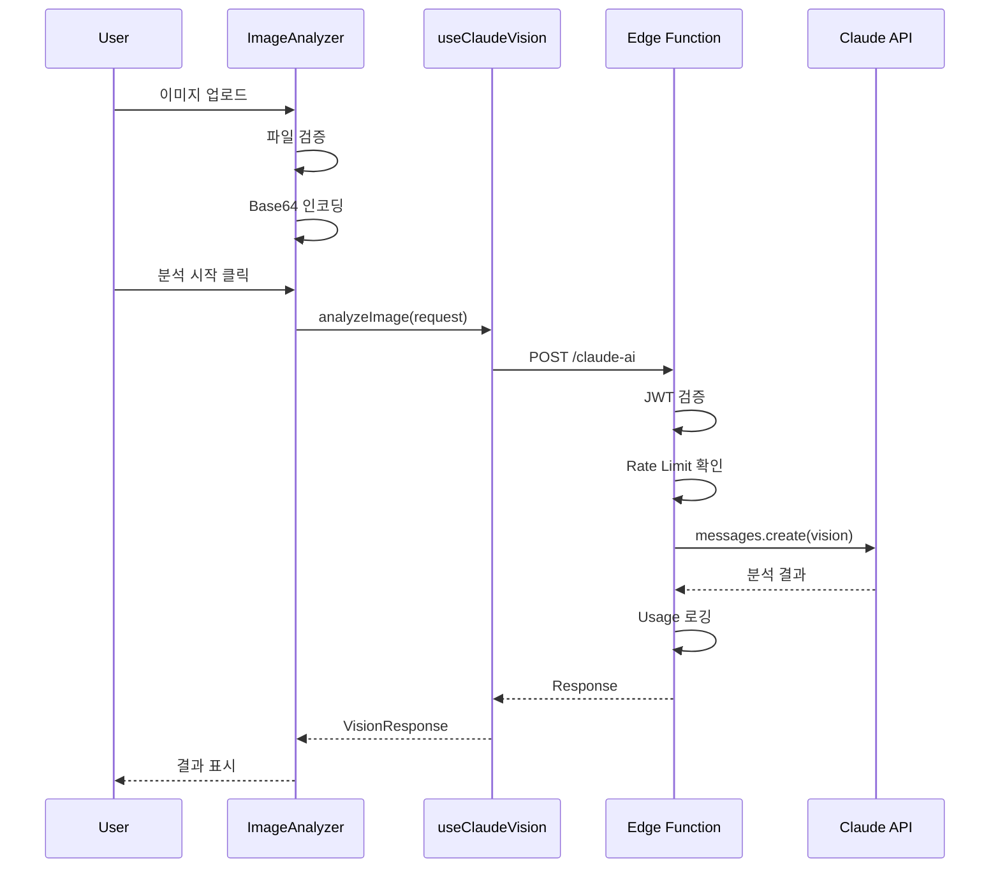

# Vision API 통합 아키텍처 설계

> Claude Vision 기능 통합을 위한 시스템 아키텍처

**작성일**: 2025-11-24
**버전**: 1.0.0
**관련 명세**: [spec/claude-integration/vision-api/requirements.md](../../spec/claude-integration/vision-api/requirements.md)

---

## 1. 시스템 구조

### 1.1 전체 아키텍처

```
┌─────────────────────────────────────────────────────────────┐
│                    Client (Browser)                          │
├─────────────────────────────────────────────────────────────┤
│  ┌─────────────────┐  ┌─────────────────┐  ┌─────────────┐ │
│  │ ImageAnalyzer   │  │ useClaudeVision │  │ ImageUtils  │ │
│  │ Component       │→ │ Hook            │→ │ (Base64)    │ │
│  └─────────────────┘  └─────────────────┘  └─────────────┘ │
└─────────────────────────────────────────────────────────────┘
                              │
                              ▼ HTTPS (JWT Auth)
┌─────────────────────────────────────────────────────────────┐
│                  Supabase Edge Functions                     │
├─────────────────────────────────────────────────────────────┤
│  ┌─────────────────────────────────────────────────────────┐│
│  │                  claude-ai/index.ts                      ││
│  │  ┌─────────────┐  ┌─────────────┐  ┌─────────────────┐  ││
│  │  │ JWT Auth    │→ │ Rate Limit  │→ │ Vision Handler  │  ││
│  │  └─────────────┘  └─────────────┘  └─────────────────┘  ││
│  └─────────────────────────────────────────────────────────┘│
└─────────────────────────────────────────────────────────────┘
                              │
                              ▼ HTTPS
┌─────────────────────────────────────────────────────────────┐
│                    Claude API (Anthropic)                    │
│  ┌─────────────────────────────────────────────────────────┐│
│  │  POST /v1/messages                                       ││
│  │  - model: claude-sonnet-4-20250514                       ││
│  │  - content: [{ type: "image", ... }, { type: "text" }]  ││
│  └─────────────────────────────────────────────────────────┘│
└─────────────────────────────────────────────────────────────┘
```

---

## 2. 컴포넌트 설계

### 2.1 React Hook: useClaudeVision

```typescript
// src/hooks/useClaudeVision.ts

import { useState, useCallback } from 'react';
import { supabase } from '@/lib/supabase';

interface VisionImage {
  source: 'base64' | 'url';
  data: string;
  mediaType: 'image/png' | 'image/jpeg' | 'image/gif' | 'image/webp';
}

interface VisionRequest {
  images: VisionImage[];
  prompt: string;
  analysisType?: 'general' | 'ui-design' | 'diagram' | 'screenshot' | 'wireframe';
  maxTokens?: number;
  stream?: boolean;
}

interface VisionResponse {
  analysis: string;
  usage: {
    inputTokens: number;
    outputTokens: number;
  };
}

interface UseClaudeVisionResult {
  analyzeImage: (request: VisionRequest) => Promise<VisionResponse>;
  analyzeImageStream: (
    request: VisionRequest,
    onChunk: (text: string) => void
  ) => Promise<VisionResponse>;
  isAnalyzing: boolean;
  error: Error | null;
  reset: () => void;
}

export function useClaudeVision(): UseClaudeVisionResult {
  const [isAnalyzing, setIsAnalyzing] = useState(false);
  const [error, setError] = useState<Error | null>(null);

  const analyzeImage = useCallback(async (request: VisionRequest): Promise<VisionResponse> => {
    setIsAnalyzing(true);
    setError(null);

    try {
      const { data, error: fnError } = await supabase.functions.invoke('claude-ai', {
        body: {
          action: 'vision',
          ...request,
        },
      });

      if (fnError) throw fnError;
      return data;
    } catch (err) {
      setError(err as Error);
      throw err;
    } finally {
      setIsAnalyzing(false);
    }
  }, []);

  const analyzeImageStream = useCallback(async (
    request: VisionRequest,
    onChunk: (text: string) => void
  ): Promise<VisionResponse> => {
    setIsAnalyzing(true);
    setError(null);

    try {
      const response = await fetch(
        `${import.meta.env.VITE_SUPABASE_URL}/functions/v1/claude-ai`,
        {
          method: 'POST',
          headers: {
            'Content-Type': 'application/json',
            'Authorization': `Bearer ${(await supabase.auth.getSession()).data.session?.access_token}`,
          },
          body: JSON.stringify({
            action: 'vision',
            stream: true,
            ...request,
          }),
        }
      );

      const reader = response.body?.getReader();
      const decoder = new TextDecoder();
      let fullText = '';

      while (reader) {
        const { done, value } = await reader.read();
        if (done) break;

        const chunk = decoder.decode(value);
        fullText += chunk;
        onChunk(fullText);
      }

      return { analysis: fullText, usage: { inputTokens: 0, outputTokens: 0 } };
    } catch (err) {
      setError(err as Error);
      throw err;
    } finally {
      setIsAnalyzing(false);
    }
  }, []);

  const reset = useCallback(() => {
    setError(null);
  }, []);

  return { analyzeImage, analyzeImageStream, isAnalyzing, error, reset };
}
```

---

### 2.2 Edge Function 확장

```typescript
// supabase/functions/claude-ai/vision-handler.ts

import Anthropic from '@anthropic-ai/sdk';

interface VisionRequestBody {
  action: 'vision';
  images: Array<{
    source: 'base64' | 'url';
    data: string;
    mediaType: string;
  }>;
  prompt: string;
  analysisType?: string;
  maxTokens?: number;
  stream?: boolean;
}

const SYSTEM_PROMPTS: Record<string, string> = {
  'ui-design': `당신은 UI/UX 디자인 전문가입니다. 제공된 디자인 이미지를 분석하고:
1. 전체적인 디자인 평가
2. 레이아웃 및 구성 분석
3. 색상/타이포그래피 평가
4. 사용성 개선 제안
5. 접근성 고려사항
을 제공해주세요.`,

  'diagram': `당신은 시스템 아키텍트입니다. 제공된 다이어그램을 분석하고:
1. 다이어그램 유형 식별
2. 구성 요소 목록
3. 요소 간 관계 정의
4. 텍스트 형식의 구조 설명
을 제공해주세요.`,

  'screenshot': `당신은 QA 엔지니어입니다. 제공된 스크린샷을 분석하고:
1. 화면 상태 설명
2. 에러 메시지 추출 (있는 경우)
3. 문제 원인 추론
4. 재현 단계 제안
을 제공해주세요.`,

  'wireframe': `당신은 프로덕트 매니저입니다. 제공된 와이어프레임을 분석하고:
1. 화면 구성 요소 식별
2. 기능 요구사항 추출
3. 사용자 플로우 추론
4. 우선순위 제안
을 제공해주세요.`,

  'general': `제공된 이미지를 분석하고 상세한 설명을 제공해주세요.`,
};

export async function handleVisionRequest(
  client: Anthropic,
  body: VisionRequestBody
): Promise<Response> {
  const { images, prompt, analysisType = 'general', maxTokens = 4096, stream } = body;

  // 이미지 컨텐츠 구성
  const imageContents = images.map((img) => ({
    type: 'image' as const,
    source: img.source === 'base64'
      ? { type: 'base64' as const, media_type: img.mediaType, data: img.data }
      : { type: 'url' as const, url: img.data },
  }));

  const systemPrompt = SYSTEM_PROMPTS[analysisType] || SYSTEM_PROMPTS['general'];

  if (stream) {
    // 스트리밍 응답
    const streamResponse = await client.messages.stream({
      model: 'claude-sonnet-4-20250514',
      max_tokens: maxTokens,
      system: systemPrompt,
      messages: [
        {
          role: 'user',
          content: [
            ...imageContents,
            { type: 'text', text: prompt },
          ],
        },
      ],
    });

    const readable = new ReadableStream({
      async start(controller) {
        for await (const event of streamResponse) {
          if (event.type === 'content_block_delta' && event.delta.type === 'text_delta') {
            controller.enqueue(new TextEncoder().encode(event.delta.text));
          }
        }
        controller.close();
      },
    });

    return new Response(readable, {
      headers: {
        'Content-Type': 'text/event-stream',
        'Cache-Control': 'no-cache',
      },
    });
  } else {
    // 일반 응답
    const response = await client.messages.create({
      model: 'claude-sonnet-4-20250514',
      max_tokens: maxTokens,
      system: systemPrompt,
      messages: [
        {
          role: 'user',
          content: [
            ...imageContents,
            { type: 'text', text: prompt },
          ],
        },
      ],
    });

    const textContent = response.content.find((c) => c.type === 'text');

    return new Response(
      JSON.stringify({
        analysis: textContent?.text || '',
        usage: {
          inputTokens: response.usage.input_tokens,
          outputTokens: response.usage.output_tokens,
        },
      }),
      { headers: { 'Content-Type': 'application/json' } }
    );
  }
}
```

---

### 2.3 이미지 유틸리티

```typescript
// src/lib/image-utils.ts

export interface ImageValidationResult {
  valid: boolean;
  error?: string;
}

export const SUPPORTED_FORMATS = ['image/png', 'image/jpeg', 'image/gif', 'image/webp'];
export const MAX_FILE_SIZE = 5 * 1024 * 1024; // 5MB
export const MAX_DIMENSION = 4096;

export function validateImage(file: File): ImageValidationResult {
  if (!SUPPORTED_FORMATS.includes(file.type)) {
    return { valid: false, error: '지원되지 않는 이미지 형식입니다. (PNG, JPG, GIF, WEBP 지원)' };
  }

  if (file.size > MAX_FILE_SIZE) {
    return { valid: false, error: '파일 크기가 5MB를 초과합니다.' };
  }

  return { valid: true };
}

export async function fileToBase64(file: File): Promise<string> {
  return new Promise((resolve, reject) => {
    const reader = new FileReader();
    reader.onload = () => {
      const result = reader.result as string;
      // Remove data URI prefix to get pure base64
      const base64 = result.split(',')[1];
      resolve(base64);
    };
    reader.onerror = reject;
    reader.readAsDataURL(file);
  });
}

export function getMediaType(file: File): 'image/png' | 'image/jpeg' | 'image/gif' | 'image/webp' {
  return file.type as 'image/png' | 'image/jpeg' | 'image/gif' | 'image/webp';
}

export async function compressImage(file: File, maxWidth: number = 2048): Promise<File> {
  return new Promise((resolve) => {
    const img = new Image();
    img.onload = () => {
      if (img.width <= maxWidth) {
        resolve(file);
        return;
      }

      const canvas = document.createElement('canvas');
      const ratio = maxWidth / img.width;
      canvas.width = maxWidth;
      canvas.height = img.height * ratio;

      const ctx = canvas.getContext('2d');
      ctx?.drawImage(img, 0, 0, canvas.width, canvas.height);

      canvas.toBlob(
        (blob) => {
          if (blob) {
            resolve(new File([blob], file.name, { type: file.type }));
          } else {
            resolve(file);
          }
        },
        file.type,
        0.9
      );
    };
    img.src = URL.createObjectURL(file);
  });
}
```

---

## 3. UI 컴포넌트 설계

### 3.1 ImageAnalyzer 컴포넌트

```typescript
// src/components/ai/ImageAnalyzer.tsx

interface ImageAnalyzerProps {
  onAnalysisComplete?: (result: string) => void;
  defaultAnalysisType?: AnalysisType;
  className?: string;
}

type AnalysisType = 'general' | 'ui-design' | 'diagram' | 'screenshot' | 'wireframe';

// 주요 UI 요소:
// 1. 드래그 앤 드롭 업로드 영역
// 2. 이미지 미리보기
// 3. 분석 유형 선택 (Select)
// 4. 추가 프롬프트 입력 (Textarea)
// 5. 분석 시작 버튼
// 6. 결과 표시 영역 (마크다운 렌더링)
// 7. 복사/재분석 버튼
```

---

## 4. 데이터 흐름



---

## 5. 보안 고려사항

### 5.1 이미지 처리
- 클라이언트에서만 Base64 인코딩 (서버 저장 금지)
- 메모리에서만 처리 후 즉시 해제
- 민감 정보 탐지 경고 (선택적)

### 5.2 API 보호
- JWT 토큰 필수
- Rate Limiting (5 req/min, 50 req/day)
- 파일 크기 제한 (5MB)

---

## 6. 에러 처리

| 에러 코드 | 설명 | 사용자 메시지 |
|----------|------|--------------|
| INVALID_IMAGE | 지원되지 않는 형식 | 이미지 형식을 확인해주세요 |
| FILE_TOO_LARGE | 5MB 초과 | 파일 크기가 너무 큽니다 |
| RATE_LIMITED | 요청 제한 초과 | 잠시 후 다시 시도해주세요 |
| API_ERROR | Claude API 오류 | 분석 중 오류가 발생했습니다 |
| NETWORK_ERROR | 네트워크 오류 | 네트워크 연결을 확인해주세요 |

---

## 변경 이력

| 버전 | 날짜 | 변경 내용 | 작성자 |
|------|------|----------|--------|
| 1.0.0 | 2025-11-24 | 초기 작성 | Claude |
