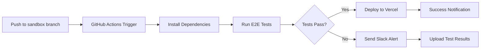

# Minu Sandbox 환경 구축 계획 v2

> Minu 서비스 연동 테스트를 위한 독립 Sandbox 환경 구축 상세 계획

**작성일**: 2025-12-02
**버전**: 2.0.0
**상태**: 📋 계획 단계
**참조**: [docs/guides/minu-integration-guidelines.md](../docs/guides/minu-integration-guidelines.md), [plan/minu-sandbox-setup.md](./minu-sandbox-setup.md)

---

## 📋 목차

1. [현황 분석](#1-현황-분석)
2. [목표 및 성공 기준](#2-목표-및-성공-기준)
3. [환경 분리 전략](#3-환경-분리-전략)
4. [인프라 구성](#4-인프라-구성)
5. [구현 단계](#5-구현-단계)
6. [테스트 전략](#6-테스트-전략)
7. [자동화 및 DevOps](#7-자동화-및-devops)
8. [보안 고려사항](#8-보안-고려사항)
9. [비용 및 리소스](#9-비용-및-리소스)
10. [리스크 관리](#10-리스크-관리)
11. [체크리스트](#11-체크리스트)

---

## 1. 현황 분석

### 1.1 기존 Minu 연동 구조

#### 구현 완료된 컴포넌트

| 컴포넌트 | 위치 | 상태 | 비고 |
|---------|------|------|------|
| **OAuth 2.0 Authorization** | `supabase/functions/oauth-authorize/` | ✅ 완료 | RFC 6749 + PKCE (S256) |
| **OAuth 2.0 Token Exchange** | `supabase/functions/oauth-token/` | ✅ 완료 | Access Token + Refresh Token |
| **Subscription API** | `supabase/functions/subscription-api/` | ✅ 완료 | 구독 상태 확인, 사용량 관리 |
| **User API** | `supabase/functions/user-api/` | ✅ 완료 | 프로필 조회 |
| **Webhook Send** | `supabase/functions/webhook-send/` | ✅ 완료 | HMAC-SHA256 서명 |
| **Session API** | `supabase/functions/session-api/` | ✅ 완료 | 세션 관리 |
| **Permission API** | `supabase/functions/permission-api/` | ✅ 완료 | 권한 체크 |
| **Team API** | `supabase/functions/team-api/` | ✅ 완료 | 팀 관리 |
| **OAuth Revoke** | `supabase/functions/oauth-revoke/` | ✅ 완료 | 토큰 폐기 |
| **CORS 설정** | `supabase/functions/_shared/cors.ts` | ✅ 완료 | 동적 Origin 검증 |
| **Audit Log** | `supabase/functions/_shared/audit-log.ts` | ✅ 완료 | 감사 로그 기록 |

#### DB 스키마

| 테이블 | 마이그레이션 파일 | 상태 |
|--------|------------------|------|
| `oauth_clients` | `20251127000000_create_oauth_tables.sql` | ✅ 완료 |
| `authorization_codes` | `20251127000000_create_oauth_tables.sql` | ✅ 완료 |
| `oauth_refresh_tokens` | `20251127000000_create_oauth_tables.sql` | ✅ 완료 |
| `oauth_audit_log` | `20251127000000_create_oauth_tables.sql` | ✅ 완료 |
| `oauth_health_monitoring` | `20251128000003_create_oauth_health_monitoring.sql` | ✅ 완료 |
| `subscriptions` | 기존 | ✅ 완료 |
| `subscription_plans` | 기존 | ✅ 완료 |
| `profiles` | 기존 | ✅ 완료 |

#### 환경별 OAuth 클라이언트

| 환경 | 서비스 | Client ID | Redirect URI | 상태 |
|------|--------|-----------|--------------|------|
| **Local** | Find | `minu-find-local` | `http://localhost:3001/auth/callback` | ✅ 등록 |
| **Local** | Frame | `minu-frame-local` | `http://localhost:3002/auth/callback` | ✅ 등록 |
| **Local** | Build | `minu-build-local` | `http://localhost:3003/auth/callback` | ✅ 등록 |
| **Local** | Keep | `minu-keep-local` | `http://localhost:3004/auth/callback` | ✅ 등록 |
| **Dev** | Find | `minu-find-dev` | `https://dev.find.minu.best/auth/callback` | ✅ 등록 |
| **Dev** | Frame | `minu-frame-dev` | `https://dev.frame.minu.best/auth/callback` | ✅ 등록 |
| **Dev** | Build | `minu-build-dev` | `https://dev.build.minu.best/auth/callback` | ✅ 등록 |
| **Dev** | Keep | `minu-keep-dev` | `https://dev.keep.minu.best/auth/callback` | ✅ 등록 |
| **Staging** | Find | `minu-find-staging` | `https://canary.find.minu.best/auth/callback` | ✅ 등록 |
| **Staging** | Frame | `minu-frame-staging` | `https://canary.frame.minu.best/auth/callback` | ✅ 등록 |
| **Staging** | Build | `minu-build-staging` | `https://canary.build.minu.best/auth/callback` | ✅ 등록 |
| **Staging** | Keep | `minu-keep-staging` | `https://canary.keep.minu.best/auth/callback` | ✅ 등록 |
| **Sandbox** | Find | `minu-find-sandbox` | `https://sandbox.find.minu.best/callback` | ⬜ 필요 |
| **Sandbox** | Frame | `minu-frame-sandbox` | `https://sandbox.frame.minu.best/callback` | ⬜ 필요 |
| **Sandbox** | Build | `minu-build-sandbox` | `https://sandbox.build.minu.best/callback` | ⬜ 필요 |
| **Sandbox** | Keep | `minu-keep-sandbox` | `https://sandbox.keep.minu.best/callback` | ⬜ 필요 |

### 1.2 현재 문제점

| 문제 | 영향 | 우선순위 |
|------|------|----------|
| **Sandbox 환경 부재** | 안전한 통합 테스트 불가 | 🔴 높음 |
| **Production 환경 의존** | 테스트 중 장애 발생 시 사용자 영향 | 🔴 높음 |
| **E2E 테스트 자동화 부족** | 수동 테스트로 인한 휴먼 에러 | 🟡 중간 |
| **테스트 데이터 격리 부족** | Production 데이터 오염 위험 | 🟡 중간 |
| **Minu 팀 온보딩 어려움** | 테스트 환경 부재로 연동 개발 지연 | 🟡 중간 |

### 1.3 요구사항

#### 기능 요구사항

1. **완전한 환경 격리**: Production 환경과 완전히 독립된 Sandbox 환경
2. **자동화된 E2E 테스트**: Playwright 기반 10개 이상의 테스트 케이스
3. **테스트 데이터 자동 리셋**: 매일 자동으로 초기화되는 테스트 계정
4. **Minu 팀 접근 권한**: OAuth Client Secret 및 테스트 계정 공유
5. **모니터링 및 알림**: Sandbox 환경 상태 실시간 모니터링

#### 비기능 요구사항

1. **성능**: API 응답 시간 p95 < 500ms
2. **안정성**: 에러율 < 1%
3. **가용성**: Uptime > 99%
4. **보안**: Production과 동일한 보안 수준 유지
5. **비용**: 월 $50 이하

---

## 2. 목표 및 성공 기준

### 2.1 핵심 목표

| 목표 | 설명 | 측정 기준 |
|------|------|-----------|
| **안전한 통합 테스트** | Production 영향 없이 Minu 연동 테스트 | Sandbox 전용 인프라 구축 |
| **E2E 테스트 자동화** | CI/CD 파이프라인에 통합된 자동화 테스트 | 10개 테스트 케이스 100% 통과 |
| **Minu 팀 온보딩 지원** | Minu 팀이 독립적으로 연동 개발 가능 | 1일 내 온보딩 완료 |
| **롤백 체계 확립** | 문제 발생 시 빠른 복구 | 롤백 소요 시간 < 5분 |

### 2.2 성공 기준

#### 기술적 기준

| 지표 | 목표 | 측정 방법 |
|------|------|-----------|
| **E2E 테스트 통과율** | 100% | Playwright 테스트 결과 |
| **API 응답 시간 (p95)** | < 500ms | Playwright 성능 메트릭 |
| **에러율** | < 1% | Supabase Logs + Sentry |
| **Edge Function 성공률** | > 99% | Supabase Dashboard |
| **테스트 커버리지** | > 80% | E2E 테스트 커버리지 |

#### 운영 기준

| 항목 | 기준 | 확인 방법 |
|------|------|-----------|
| **환경 독립성** | Production 영향 없음 | 트래픽 모니터링 |
| **자동 리셋** | 매일 1회 자동 리셋 | Cron Job 로그 |
| **문서 완성도** | 모든 API 문서화 | OpenAPI 스펙 100% |
| **온보딩 시간** | 1일 내 완료 | Minu 팀 피드백 |

---

## 3. 환경 분리 전략

### 3.1 환경 구성 비교

| 항목 | Production | Sandbox | 차이점 |
|------|-----------|---------|--------|
| **도메인** | `ideaonaction.ai` | `sandbox.ideaonaction.ai` | 서브도메인 분리 |
| **Supabase 프로젝트** | 기존 프로젝트 | **신규 Sandbox 프로젝트** | 완전 격리 (권장) |
| **DB 스키마** | `public` | `public` (별도 프로젝트) | 프로젝트 레벨 분리 |
| **OAuth 클라이언트** | Production 클라이언트 | **Sandbox 전용 클라이언트** | 4개 추가 등록 |
| **Minu 서비스** | `*.minu.best` | `sandbox.*.minu.best` | 테스트 인스턴스 |
| **테스트 데이터** | 실제 사용자 데이터 | **자동 시드 데이터** | 완전 격리 |
| **환경 변수** | Production Secrets | **Sandbox Secrets** | 별도 관리 |
| **CORS 허용 Origin** | Production Origins | **Sandbox Origins** | `sandbox.*.minu.best` 추가 |

### 3.2 Supabase 프로젝트 옵션 분석

#### ✅ 옵션 1: 별도 Sandbox 프로젝트 생성 (권장)

**장점**:
- ✅ Production과 완전 격리 (안전성 최고)
- ✅ 리소스 독립적 사용 (성능 영향 없음)
- ✅ 데이터 오염 위험 없음
- ✅ 독립적인 DB 마이그레이션 관리
- ✅ 환경별 Edge Functions 배포 가능

**단점**:
- ❌ 추가 비용 발생 (Free Tier: $0/월, Pro: $25/월)
- ❌ 프로젝트 관리 복잡도 증가
- ❌ 마이그레이션 이중 관리 필요

**비용**:
- **Free Tier**: $0/월 (500MB DB, 2GB Bandwidth, 500,000 Edge Function Invocations)
- **Pro Tier**: $25/월 (8GB DB, 250GB Bandwidth, 2,000,000 Edge Function Invocations)

**결정**: ✅ **옵션 1 선택** - 안정성과 격리성 우선

#### ⬜ 옵션 2: 스키마 분리 (대안)

**장점**:
- ✅ 추가 비용 없음
- ✅ 단일 프로젝트 관리

**단점**:
- ❌ 리소스 공유로 인한 성능 영향 가능
- ❌ 실수로 Production 데이터 접근 위험
- ❌ Edge Functions 분리 어려움

**구현 방법**:
```sql
-- 마이그레이션: 20251202000001_create_sandbox_schema.sql
CREATE SCHEMA public_sandbox;

-- 모든 테이블을 public_sandbox에 복제
CREATE TABLE public_sandbox.oauth_clients (LIKE public.oauth_clients INCLUDING ALL);
-- ... 모든 테이블 복제
```

### 3.3 환경 변수 분리

#### Production 환경 변수

```bash
# Production Supabase
VITE_SUPABASE_URL=https://zykjdneewbzyazfukzyg.supabase.co
VITE_SUPABASE_ANON_KEY=<production_anon_key>
SUPABASE_SERVICE_ROLE_KEY=<production_service_role_key>

# Production OAuth
OAUTH_JWT_SECRET=<production_jwt_secret>
WEBHOOK_SECRET=<production_webhook_secret>
OAUTH_LOGIN_PAGE_URL=https://www.ideaonaction.ai/login
```

#### Sandbox 환경 변수 (신규)

```bash
# Sandbox Supabase
VITE_SUPABASE_URL_SANDBOX=https://<sandbox-project-ref>.supabase.co
VITE_SUPABASE_ANON_KEY_SANDBOX=<sandbox_anon_key>
SUPABASE_SERVICE_ROLE_KEY_SANDBOX=<sandbox_service_role_key>

# Sandbox OAuth
OAUTH_JWT_SECRET_SANDBOX=<sandbox_jwt_secret>
WEBHOOK_SECRET_SANDBOX=<sandbox_webhook_secret>
OAUTH_LOGIN_PAGE_URL_SANDBOX=https://sandbox.ideaonaction.ai/login

# Sandbox 환경 식별자
ENVIRONMENT=sandbox
```

---

## 4. 인프라 구성

### 4.1 아키텍처 다이어그램

```
┌─────────────────────────────────────────────────────────────────────┐
│                     Sandbox 환경 전체 구조                           │
├─────────────────────────────────────────────────────────────────────┤
│                                                                     │
│  ┌──────────────────────────────────────────────────────────────┐  │
│  │  Frontend (Vercel Preview)                                   │  │
│  │  - URL: https://sandbox.ideaonaction.ai                      │  │
│  │  - Branch: sandbox                                           │  │
│  │  - Auto Deploy: Push to sandbox branch                       │  │
│  └────────────────────┬─────────────────────────────────────────┘  │
│                       │ HTTPS                                       │
│                       ▼                                             │
│  ┌──────────────────────────────────────────────────────────────┐  │
│  │  Supabase Sandbox Project (신규 생성)                         │  │
│  │  - Project ID: <sandbox-project-ref>                         │  │
│  │  - Region: Northeast Asia (Seoul)                            │  │
│  │  - Plan: Free Tier → Pro (필요 시)                            │  │
│  │                                                              │  │
│  │  ┌────────────────────────────────────────────────────────┐  │  │
│  │  │  PostgreSQL Database                                   │  │  │
│  │  │  - Schema: public                                      │  │  │
│  │  │  - RLS: 활성화                                          │  │  │
│  │  │  - 테스트 데이터: 자동 시드                             │  │  │
│  │  └────────────────────────────────────────────────────────┘  │  │
│  │                                                              │  │
│  │  ┌────────────────────────────────────────────────────────┐  │  │
│  │  │  Edge Functions                                        │  │  │
│  │  │  - oauth-authorize                                     │  │  │
│  │  │  - oauth-token                                         │  │  │
│  │  │  - subscription-api                                    │  │  │
│  │  │  - user-api                                            │  │  │
│  │  │  - session-api                                         │  │  │
│  │  │  - team-api                                            │  │  │
│  │  │  - permission-api                                      │  │  │
│  │  │  - oauth-revoke                                        │  │  │
│  │  │  - webhook-send                                        │  │  │
│  │  └────────────────────────────────────────────────────────┘  │  │
│  └──────────────────────┬───────────────────────────────────────┘  │
│                         │ OAuth 2.0 + PKCE                          │
│                         ▼                                           │
│  ┌──────────────────────────────────────────────────────────────┐  │
│  │  Minu Services (Sandbox Instances)                           │  │
│  │  - https://sandbox.find.minu.best                            │  │
│  │  - https://sandbox.frame.minu.best                           │  │
│  │  - https://sandbox.build.minu.best                           │  │
│  │  - https://sandbox.keep.minu.best                            │  │
│  └──────────────────────────────────────────────────────────────┘  │
│                                                                     │
└─────────────────────────────────────────────────────────────────────┘

┌─────────────────────────────────────────────────────────────────────┐
│                     CI/CD & Monitoring                               │
├─────────────────────────────────────────────────────────────────────┤
│                                                                     │
│  ┌──────────────────────────────────────────────────────────────┐  │
│  │  GitHub Actions                                              │  │
│  │  - Workflow: .github/workflows/sandbox-e2e.yml               │  │
│  │  - Trigger: Push to sandbox branch, Schedule (6시간마다)     │  │
│  │  - Jobs: Deploy → E2E Test → Report                          │  │
│  └──────────────────────────────────────────────────────────────┘  │
│                                                                     │
│  ┌──────────────────────────────────────────────────────────────┐  │
│  │  Playwright E2E Tests                                        │  │
│  │  - Test Files: tests/e2e/sandbox/*.spec.ts                   │  │
│  │  - Test Count: 10개                                          │  │
│  │  - Test Duration: ~5분                                       │  │
│  └──────────────────────────────────────────────────────────────┘  │
│                                                                     │
│  ┌──────────────────────────────────────────────────────────────┐  │
│  │  Monitoring & Alerting                                       │  │
│  │  - Supabase Dashboard: 실시간 메트릭                         │  │
│  │  - Sentry: 에러 추적                                         │  │
│  │  - Slack: 알림 (테스트 실패, 에러율 증가)                     │  │
│  └──────────────────────────────────────────────────────────────┘  │
│                                                                     │
└─────────────────────────────────────────────────────────────────────┘
```

### 4.2 네트워크 플로우

```
1. OAuth Authorization Flow
┌─────────┐                  ┌──────────────┐                  ┌──────────────┐
│ Minu    │  1. /authorize   │  Sandbox     │  2. Login UI     │   User       │
│ Service │ ───────────────▶ │  IdeaOA      │ ───────────────▶ │  (Browser)   │
│         │                  │              │                  │              │
│         │  4. code +state  │              │  3. Login Submit │              │
│         │ ◀─────────────── │              │ ◀─────────────── │              │
└─────────┘                  └──────────────┘                  └──────────────┘
     │
     │ 5. POST /oauth-token
     │    (code → access_token)
     ▼
┌──────────────┐
│  Sandbox     │
│  IdeaOA      │
│  (Token API) │
└──────────────┘

2. Subscription Check Flow
┌─────────┐                  ┌──────────────┐                  ┌──────────────┐
│ Minu    │  1. Check Sub    │  Sandbox     │  2. Query DB     │  Sandbox     │
│ Service │ ───────────────▶ │  Sub API     │ ───────────────▶ │  Supabase    │
│         │                  │              │                  │              │
│         │  4. Sub Status   │              │  3. Sub Data     │              │
│         │ ◀─────────────── │              │ ◀─────────────── │              │
└─────────┘                  └──────────────┘                  └──────────────┘

3. Webhook Flow
┌──────────────┐                  ┌─────────┐
│  Sandbox     │  1. Event        │ Minu    │
│  IdeaOA      │ ───────────────▶ │ Service │
│  (Webhook)   │    + HMAC Sig    │         │
│              │                  │         │
│              │  2. 200 OK       │         │
│              │ ◀─────────────── │         │
└──────────────┘                  └─────────┘
```

### 4.3 데이터 플로우

```
┌─────────────────────────────────────────────────────────────┐
│                    Sandbox 데이터 플로우                     │
├─────────────────────────────────────────────────────────────┤
│                                                             │
│  1. 초기화 (매일 00:00 KST)                                  │
│     ┌──────────────┐                                       │
│     │ Cron Job     │                                       │
│     │ (GitHub      │                                       │
│     │  Actions)    │                                       │
│     └──────┬───────┘                                       │
│            │ supabase db reset                             │
│            ▼                                               │
│     ┌──────────────┐                                       │
│     │ Sandbox DB   │                                       │
│     │ 전체 초기화  │                                       │
│     └──────┬───────┘                                       │
│            │ 마이그레이션 재적용                            │
│            ▼                                               │
│     ┌──────────────┐                                       │
│     │ 시드 데이터  │                                       │
│     │ - 5개 테스트 │                                       │
│     │   계정       │                                       │
│     │ - OAuth      │                                       │
│     │   클라이언트 │                                       │
│     └──────────────┘                                       │
│                                                             │
│  2. 테스트 실행 (수시)                                       │
│     ┌──────────────┐                                       │
│     │ E2E Tests    │                                       │
│     │ (Playwright) │                                       │
│     └──────┬───────┘                                       │
│            │ 테스트 데이터 사용                             │
│            ▼                                               │
│     ┌──────────────┐                                       │
│     │ Sandbox DB   │                                       │
│     │ 데이터 변경  │                                       │
│     └──────────────┘                                       │
│            │ 자동으로 다음날 리셋됨                          │
│            ▼                                               │
│     ┌──────────────┐                                       │
│     │ 다음 날      │                                       │
│     │ 00:00 리셋   │                                       │
│     └──────────────┘                                       │
│                                                             │
└─────────────────────────────────────────────────────────────┘
```

---

## 5. 구현 단계

### Phase 1: Supabase Sandbox 프로젝트 설정 (Week 1)

#### 작업 1.1: Supabase 프로젝트 생성

**목표**: Sandbox 전용 Supabase 프로젝트 생성

**작업 목록**:
- [ ] Supabase 대시보드에서 신규 프로젝트 생성
  - 프로젝트명: `idea-on-action-sandbox`
  - Region: `Northeast Asia (Seoul)`
  - Plan: `Free Tier` (초기) → `Pro` (필요 시 업그레이드)
- [ ] 프로젝트 설정 정보 기록
  - Project ID: `<sandbox-project-ref>`
  - Project URL: `https://<sandbox-project-ref>.supabase.co`
  - Anon Key: `<sandbox_anon_key>`
  - Service Role Key: `<sandbox_service_role_key>`

**산출물**:
- Sandbox 프로젝트 접속 정보 문서 (`docs/sandbox-supabase-credentials.md`, 비공개)

#### 작업 1.2: 환경 변수 설정

**목표**: Sandbox 전용 환경 변수 설정

**작업 목록**:
- [ ] `.env.sandbox` 파일 생성
  ```bash
  # Sandbox Supabase
  VITE_SUPABASE_URL=https://<sandbox-project-ref>.supabase.co
  VITE_SUPABASE_ANON_KEY=<sandbox_anon_key>
  SUPABASE_SERVICE_ROLE_KEY=<sandbox_service_role_key>

  # Sandbox OAuth
  OAUTH_JWT_SECRET=<generate_new_random_secret>
  WEBHOOK_SECRET=<generate_new_random_secret>
  OAUTH_LOGIN_PAGE_URL=https://sandbox.ideaonaction.ai/login

  # Environment Identifier
  ENVIRONMENT=sandbox
  NODE_ENV=development
  ```
- [ ] Supabase Secrets 설정 (Edge Functions용)
  ```bash
  supabase secrets set ENVIRONMENT=sandbox --project-ref <sandbox-ref>
  supabase secrets set JWT_SECRET=<sandbox_jwt_secret> --project-ref <sandbox-ref>
  supabase secrets set WEBHOOK_SECRET=<sandbox_webhook_secret> --project-ref <sandbox-ref>
  supabase secrets set OAUTH_LOGIN_PAGE_URL=https://sandbox.ideaonaction.ai/login --project-ref <sandbox-ref>
  ```
- [ ] `.env.sandbox.example` 파일 작성 (Git 커밋용)

**산출물**:
- `.env.sandbox` (로컬 개발용, Git ignore)
- `.env.sandbox.example` (템플릿, Git 커밋)

#### 작업 1.3: DB 마이그레이션 적용

**목표**: Production 마이그레이션 전체를 Sandbox에 적용

**작업 목록**:
- [ ] Supabase CLI 로그인 및 프로젝트 연결
  ```bash
  supabase login
  supabase link --project-ref <sandbox-ref>
  ```
- [ ] 모든 마이그레이션 파일 적용
  ```bash
  supabase db push --project-ref <sandbox-ref>
  ```
- [ ] 마이그레이션 적용 확인
  ```bash
  supabase db lint --project-ref <sandbox-ref>
  ```

**산출물**:
- Sandbox DB 스키마 (Production과 동일)

#### 작업 1.4: Sandbox 전용 시드 데이터 작성

**목표**: 테스트 계정 및 OAuth 클라이언트 시드 데이터 작성

**작업 목록**:
- [ ] 마이그레이션 파일 작성: `supabase/migrations/20251202100001_seed_sandbox_oauth_clients.sql`
  ```sql
  -- Sandbox OAuth 클라이언트 등록
  INSERT INTO oauth_clients (
    client_id,
    client_secret,
    client_name,
    redirect_uris,
    allowed_scopes,
    require_pkce,
    environment,
    is_active
  ) VALUES
    (
      'minu-find-sandbox',
      encode(gen_random_bytes(32), 'hex'),
      'Minu Find (Sandbox)',
      ARRAY['https://sandbox.find.minu.best/callback'],
      ARRAY['profile', 'subscription:read', 'subscription:write'],
      true,
      'sandbox',
      true
    ),
    (
      'minu-frame-sandbox',
      encode(gen_random_bytes(32), 'hex'),
      'Minu Frame (Sandbox)',
      ARRAY['https://sandbox.frame.minu.best/callback'],
      ARRAY['profile', 'subscription:read', 'subscription:write'],
      true,
      'sandbox',
      true
    ),
    (
      'minu-build-sandbox',
      encode(gen_random_bytes(32), 'hex'),
      'Minu Build (Sandbox)',
      ARRAY['https://sandbox.build.minu.best/callback'],
      ARRAY['profile', 'subscription:read', 'subscription:write'],
      true,
      'sandbox',
      true
    ),
    (
      'minu-keep-sandbox',
      encode(gen_random_bytes(32), 'hex'),
      'Minu Keep (Sandbox)',
      ARRAY['https://sandbox.keep.minu.best/callback'],
      ARRAY['profile', 'subscription:read', 'subscription:write'],
      true,
      'sandbox',
      true
    );
  ```
- [ ] 마이그레이션 파일 작성: `supabase/migrations/20251202100002_seed_sandbox_test_accounts.sql`
  ```sql
  -- 5개 테스트 계정 생성
  -- 1. test-free@ideaonaction.ai (Free 플랜)
  -- 2. test-basic@ideaonaction.ai (Basic 플랜)
  -- 3. test-pro@ideaonaction.ai (Pro 플랜)
  -- 4. test-expired@ideaonaction.ai (Expired 플랜)
  -- 5. test-enterprise@ideaonaction.ai (Enterprise 플랜)

  -- 상세 내용은 기존 plan/minu-sandbox-setup.md 참조
  ```
- [ ] 마이그레이션 적용
  ```bash
  supabase db push --project-ref <sandbox-ref>
  ```

**산출물**:
- 시드 데이터 마이그레이션 파일 2개
- 테스트 계정 5개 + OAuth 클라이언트 4개

#### 작업 1.5: Edge Functions 배포

**목표**: 모든 Edge Functions를 Sandbox 프로젝트에 배포

**작업 목록**:
- [ ] Edge Functions 목록 확인
  ```bash
  ls supabase/functions/
  ```
- [ ] 배포 스크립트 작성: `scripts/deploy-edge-functions-sandbox.sh`
  ```bash
  #!/bin/bash
  PROJECT_REF="<sandbox-ref>"

  FUNCTIONS=(
    "oauth-authorize"
    "oauth-token"
    "oauth-revoke"
    "subscription-api"
    "user-api"
    "session-api"
    "team-api"
    "permission-api"
    "webhook-send"
  )

  for func in "${FUNCTIONS[@]}"; do
    echo "Deploying $func..."
    supabase functions deploy $func --project-ref $PROJECT_REF
  done

  echo "✅ All Edge Functions deployed to Sandbox!"
  ```
- [ ] 실행 권한 부여 및 배포
  ```bash
  chmod +x scripts/deploy-edge-functions-sandbox.sh
  ./scripts/deploy-edge-functions-sandbox.sh
  ```
- [ ] 배포 확인
  ```bash
  supabase functions list --project-ref <sandbox-ref>
  ```

**산출물**:
- 배포된 Edge Functions 9개
- 배포 스크립트 `scripts/deploy-edge-functions-sandbox.sh`

#### 작업 1.6: CORS 설정 업데이트

**목표**: Sandbox Origins 허용 추가

**작업 목록**:
- [ ] `supabase/functions/_shared/cors.ts` 수정
  ```typescript
  const ALLOWED_ORIGINS = {
    production: [
      'https://www.ideaonaction.ai',
      'https://ideaonaction.ai',
      'https://minu.best',
      'https://find.minu.best',
      'https://frame.minu.best',
      'https://build.minu.best',
      'https://keep.minu.best',
    ],
    sandbox: [
      'https://sandbox.ideaonaction.ai',
      'https://sandbox.find.minu.best',
      'https://sandbox.frame.minu.best',
      'https://sandbox.build.minu.best',
      'https://sandbox.keep.minu.best',
    ],
    development: [
      'http://localhost:8080',
      'http://localhost:3000',
      'http://localhost:5173',
    ],
    preview: /^https:\/\/.*\.vercel\.app$/,
  }
  ```
- [ ] Edge Functions 재배포
  ```bash
  ./scripts/deploy-edge-functions-sandbox.sh
  ```

**산출물**:
- 업데이트된 `cors.ts`
- 재배포된 Edge Functions

---

### Phase 2: Vercel Sandbox 배포 설정 (Week 2)

#### 작업 2.1: Sandbox 브랜치 생성

**목표**: `sandbox` 브랜치 생성 및 Vercel 연동

**작업 목록**:
- [ ] Git 브랜치 생성
  ```bash
  git checkout -b sandbox
  git push origin sandbox
  ```
- [ ] Vercel 대시보드에서 프로젝트 설정
  - Production Branch: `main`
  - Preview Branches: `sandbox` 포함
  - Domain: `sandbox.ideaonaction.ai` 연결

**산출물**:
- `sandbox` 브랜치
- Vercel Preview Deployment: `https://sandbox.ideaonaction.ai`

#### 작업 2.2: Sandbox 환경 변수 설정 (Vercel)

**목표**: Vercel에 Sandbox 환경 변수 등록

**작업 목록**:
- [ ] Vercel 대시보드 → Settings → Environment Variables
- [ ] `sandbox` 브랜치 전용 환경 변수 등록
  ```
  VITE_SUPABASE_URL=https://<sandbox-ref>.supabase.co
  VITE_SUPABASE_ANON_KEY=<sandbox_anon_key>
  VITE_MINU_ENV=sandbox
  ENVIRONMENT=sandbox
  ```

**산출물**:
- Vercel 환경 변수 설정 완료

#### 작업 2.3: OAuth Client Secret 추출 및 공유

**목표**: OAuth Client Secret을 Minu 팀에 안전하게 전달

**작업 목록**:
- [ ] Client Secret 추출 쿼리 실행
  ```sql
  SELECT
    client_id,
    client_secret,
    client_name,
    redirect_uris,
    allowed_scopes
  FROM oauth_clients
  WHERE environment = 'sandbox'
  ORDER BY client_id;
  ```
- [ ] 결과를 안전한 방법으로 전달
  - 방법 1: 1Password Secure Note
  - 방법 2: Bitwarden Send (자동 만료)
  - 방법 3: GitHub Secret Gist (Private)
- [ ] Minu 팀에게 전달 완료 확인

**산출물**:
- OAuth 클라이언트 정보 문서 (Minu 팀 공유용)

#### 작업 2.4: 테스트 계정 문서 작성

**목표**: 테스트 계정 정보 문서화 및 공유

**작업 목록**:
- [ ] 문서 작성: `docs/sandbox-test-accounts.md` (비공개)
  ```markdown
  # Sandbox 테스트 계정

  | 계정 | 이메일 | 비밀번호 | 플랜 | 용도 |
  |------|--------|----------|------|------|
  | 1 | test-free@ideaonaction.ai | Test1234! | Free | 무료 플랜 테스트 |
  | 2 | test-basic@ideaonaction.ai | Test1234! | Basic | 기본 플랜 테스트 |
  | 3 | test-pro@ideaonaction.ai | Test1234! | Pro | 프로 플랜 테스트 |
  | 4 | test-expired@ideaonaction.ai | Test1234! | Expired | 만료 처리 테스트 |
  | 5 | test-enterprise@ideaonaction.ai | Test1234! | Enterprise | 팀 관리 테스트 |
  ```
- [ ] Minu 팀에게 전달

**산출물**:
- 테스트 계정 문서

---

### Phase 3: E2E 테스트 스크립트 작성 (Week 3)

#### 작업 3.1: Playwright 설정

**목표**: Sandbox 전용 Playwright 설정 파일 작성

**작업 목록**:
- [ ] 설정 파일 작성: `playwright.config.sandbox.ts`
  ```typescript
  import { defineConfig } from '@playwright/test';

  export default defineConfig({
    testDir: './tests/e2e/sandbox',
    timeout: 60000,
    retries: 2,
    workers: 4,
    use: {
      baseURL: 'https://sandbox.ideaonaction.ai',
      screenshot: 'only-on-failure',
      video: 'retain-on-failure',
      trace: 'retain-on-failure',
    },
    projects: [
      {
        name: 'OAuth Flow',
        testMatch: /oauth.*\.spec\.ts/,
      },
      {
        name: 'API Integration',
        testMatch: /api.*\.spec\.ts/,
      },
      {
        name: 'Subscription',
        testMatch: /subscription.*\.spec\.ts/,
      },
    ],
    reporter: [
      ['html', { outputFolder: 'playwright-report/sandbox' }],
      ['json', { outputFile: 'playwright-report/sandbox-results.json' }],
      ['junit', { outputFile: 'playwright-report/sandbox-results.xml' }],
    ],
  });
  ```
- [ ] 테스트 디렉토리 구조 생성
  ```bash
  mkdir -p tests/e2e/sandbox
  mkdir -p tests/e2e/sandbox/helpers
  ```

**산출물**:
- `playwright.config.sandbox.ts`
- 테스트 디렉토리 구조

#### 작업 3.2: 헬퍼 함수 작성

**목표**: 공통 헬퍼 함수 작성

**작업 목록**:
- [ ] 파일 작성: `tests/e2e/sandbox/helpers/auth.ts`
  ```typescript
  import { APIRequestContext } from '@playwright/test';

  export async function getAccessToken(
    request: APIRequestContext,
    email: string,
    password: string
  ): Promise<string> {
    // OAuth 플로우를 통해 Access Token 획득
    // 구현 세부사항 생략 (기존 plan/minu-sandbox-setup.md 참조)
    return 'access_token';
  }

  export async function refreshAccessToken(
    request: APIRequestContext,
    refreshToken: string
  ): Promise<string> {
    // Refresh Token으로 새 Access Token 획득
    return 'new_access_token';
  }

  export function decodeJWT(token: string): Record<string, unknown> {
    // JWT 디코딩
    const parts = token.split('.');
    const payload = JSON.parse(atob(parts[1]));
    return payload;
  }
  ```
- [ ] 파일 작성: `tests/e2e/sandbox/helpers/api.ts`
  ```typescript
  import { APIRequestContext } from '@playwright/test';

  export async function callAPI(
    request: APIRequestContext,
    method: string,
    endpoint: string,
    token: string,
    body?: Record<string, unknown>
  ): Promise<Response> {
    const response = await request.fetch(
      `https://sandbox.ideaonaction.ai/functions/v1${endpoint}`,
      {
        method,
        headers: {
          'Authorization': `Bearer ${token}`,
          'Content-Type': 'application/json',
        },
        data: body,
      }
    );
    return response;
  }
  ```

**산출물**:
- `tests/e2e/sandbox/helpers/auth.ts`
- `tests/e2e/sandbox/helpers/api.ts`

#### 작업 3.3: E2E 테스트 케이스 작성 (10개)

**목표**: 핵심 시나리오 E2E 테스트 작성

**작업 목록**:
- [ ] Test 1: OAuth Authorization Code Flow (`oauth-authorization-flow.spec.ts`)
- [ ] Test 2: Token Exchange (`oauth-token-exchange.spec.ts`)
- [ ] Test 3: Token Refresh (`oauth-token-refresh.spec.ts`)
- [ ] Test 4: Permission Check (역할별) (`permission-check.spec.ts`)
- [ ] Test 5: Session Management (`session-management.spec.ts`)
- [ ] Test 6: Team Management (`team-management.spec.ts`)
- [ ] Test 7: Rate Limiting (`rate-limiting.spec.ts`)
- [ ] Test 8: Audit Log 기록 (`audit-log.spec.ts`)
- [ ] Test 9: 프로필 동기화 (`profile-sync.spec.ts`)
- [ ] Test 10: Webhook 검증 (`webhook-verification.spec.ts`)

**상세 테스트 케이스**: [기존 plan/minu-sandbox-setup.md 5.2절 참조](#52-테스트-케이스-상세)

**산출물**:
- E2E 테스트 스크립트 10개

#### 작업 3.4: 테스트 실행 및 검증

**목표**: 로컬에서 전체 테스트 실행 및 통과 확인

**작업 목록**:
- [ ] package.json 스크립트 추가
  ```json
  {
    "scripts": {
      "test:e2e:sandbox": "playwright test -c playwright.config.sandbox.ts",
      "test:e2e:sandbox:ui": "playwright test -c playwright.config.sandbox.ts --ui",
      "test:e2e:sandbox:debug": "playwright test -c playwright.config.sandbox.ts --debug"
    }
  }
  ```
- [ ] 전체 테스트 실행
  ```bash
  npm run test:e2e:sandbox
  ```
- [ ] 테스트 결과 확인
  - 통과율: 100%
  - 실패 원인 분석 및 수정

**산출물**:
- 테스트 실행 결과 리포트

---

### Phase 4: CI/CD 통합 및 자동화 (Week 4)

#### 작업 4.1: GitHub Actions 워크플로우 작성

**목표**: Sandbox E2E 테스트 자동화

**작업 목록**:
- [ ] 워크플로우 파일 작성: `.github/workflows/sandbox-e2e.yml`
  ```yaml
  name: Sandbox E2E Tests

  on:
    push:
      branches: [sandbox]
    schedule:
      - cron: '0 */6 * * *'  # 6시간마다 실행
    workflow_dispatch:  # 수동 실행 가능

  jobs:
    test:
      runs-on: ubuntu-latest
      timeout-minutes: 30

      steps:
        - name: Checkout code
          uses: actions/checkout@v3

        - name: Setup Node.js
          uses: actions/setup-node@v3
          with:
            node-version: '20'
            cache: 'npm'

        - name: Install dependencies
          run: npm ci

        - name: Install Playwright browsers
          run: npx playwright install --with-deps

        - name: Run Sandbox E2E tests
          run: npm run test:e2e:sandbox
          env:
            VITE_SUPABASE_URL: ${{ secrets.VITE_SUPABASE_URL_SANDBOX }}
            VITE_SUPABASE_ANON_KEY: ${{ secrets.VITE_SUPABASE_ANON_KEY_SANDBOX }}

        - name: Upload test results
          if: always()
          uses: actions/upload-artifact@v3
          with:
            name: playwright-report
            path: playwright-report/
            retention-days: 30

        - name: Notify on failure
          if: failure()
          uses: 8398a7/action-slack@v3
          with:
            status: ${{ job.status }}
            text: 'Sandbox E2E 테스트 실패!'
            webhook_url: ${{ secrets.SLACK_WEBHOOK_URL }}
  ```
- [ ] GitHub Secrets 등록
  - `VITE_SUPABASE_URL_SANDBOX`
  - `VITE_SUPABASE_ANON_KEY_SANDBOX`
  - `SLACK_WEBHOOK_URL` (선택)

**산출물**:
- `.github/workflows/sandbox-e2e.yml`

#### 작업 4.2: 자동 리셋 스크립트 작성

**목표**: 매일 00:00 KST에 Sandbox DB 자동 리셋

**작업 목록**:
- [ ] 스크립트 작성: `scripts/reset-sandbox.sh`
  ```bash
  #!/bin/bash
  set -e

  PROJECT_REF="<sandbox-ref>"

  echo "🔄 Resetting Sandbox environment..."

  # Supabase DB 리셋
  supabase db reset --project-ref $PROJECT_REF

  echo "✅ Sandbox environment reset complete!"
  echo "📊 Test accounts restored: 5"
  echo "🔑 OAuth clients restored: 4"
  ```
- [ ] GitHub Actions 워크플로우 작성: `.github/workflows/sandbox-reset.yml`
  ```yaml
  name: Sandbox Daily Reset

  on:
    schedule:
      - cron: '0 15 * * *'  # 매일 00:00 KST (15:00 UTC)
    workflow_dispatch:  # 수동 실행 가능

  jobs:
    reset:
      runs-on: ubuntu-latest
      steps:
        - name: Checkout code
          uses: actions/checkout@v3

        - name: Setup Supabase CLI
          uses: supabase/setup-cli@v1

        - name: Reset Sandbox DB
          run: ./scripts/reset-sandbox.sh
          env:
            SUPABASE_ACCESS_TOKEN: ${{ secrets.SUPABASE_ACCESS_TOKEN }}

        - name: Notify on completion
          uses: 8398a7/action-slack@v3
          with:
            status: success
            text: 'Sandbox 환경이 성공적으로 리셋되었습니다.'
            webhook_url: ${{ secrets.SLACK_WEBHOOK_URL }}
  ```

**산출물**:
- `scripts/reset-sandbox.sh`
- `.github/workflows/sandbox-reset.yml`

#### 작업 4.3: 모니터링 설정

**목표**: Sandbox 환경 상태 모니터링

**작업 목록**:
- [ ] Supabase Dashboard 알림 설정
  - Error Rate > 5%: Slack 알림
  - DB Connection Failure: Email 알림
- [ ] Sentry 프로젝트 생성 (Sandbox 전용)
  - DSN: `<sandbox_sentry_dsn>`
  - 환경 변수 등록: `VITE_SENTRY_DSN_SANDBOX`
- [ ] Uptime 모니터링 (선택)
  - UptimeRobot 또는 Pingdom

**산출물**:
- 모니터링 대시보드 URL
- 알림 설정 완료

---

## 6. 테스트 전략

### 6.1 테스트 범위

| 영역 | 테스트 타입 | 커버리지 목표 | 도구 |
|------|------------|--------------|------|
| **OAuth 플로우** | E2E | 100% | Playwright |
| **API 통합** | E2E | 100% | Playwright |
| **구독 기능** | E2E | 100% | Playwright |
| **권한 체크** | E2E | 100% | Playwright |
| **세션 관리** | E2E | 100% | Playwright |
| **Webhook** | E2E | 100% | Playwright |

### 6.2 테스트 케이스 목록

| No | 테스트 케이스 | 파일명 | 우선순위 | 예상 소요 시간 |
|----|-------------|--------|----------|---------------|
| 1 | OAuth Authorization Code Flow | `oauth-authorization-flow.spec.ts` | 🔴 높음 | 30초 |
| 2 | Token Exchange | `oauth-token-exchange.spec.ts` | 🔴 높음 | 20초 |
| 3 | Token Refresh | `oauth-token-refresh.spec.ts` | 🔴 높음 | 20초 |
| 4 | Permission Check (역할별) | `permission-check.spec.ts` | 🟡 중간 | 40초 |
| 5 | Session Management | `session-management.spec.ts` | 🟡 중간 | 40초 |
| 6 | Team Management | `team-management.spec.ts` | 🟡 중간 | 50초 |
| 7 | Rate Limiting (429) | `rate-limiting.spec.ts` | 🟢 낮음 | 30초 |
| 8 | Audit Log 기록 | `audit-log.spec.ts` | 🟢 낮음 | 30초 |
| 9 | 프로필 동기화 | `profile-sync.spec.ts` | 🟡 중간 | 30초 |
| 10 | Webhook 검증 | `webhook-verification.spec.ts` | 🟡 중간 | 30초 |

**총 예상 시간**: ~5분

### 6.3 테스트 시나리오 상세

#### 1. OAuth Authorization Code Flow

```typescript
// tests/e2e/sandbox/oauth-authorization-flow.spec.ts
import { test, expect } from '@playwright/test';

test('OAuth Authorization Code Flow - Full Cycle', async ({ page }) => {
  // 1. Minu Find 접속
  await page.goto('https://sandbox.find.minu.best');

  // 2. 로그인 버튼 클릭
  await page.click('text=로그인');

  // 3. ideaonaction.ai로 리다이렉트 확인
  await expect(page).toHaveURL(/sandbox\.ideaonaction\.ai\/oauth\/authorize/);

  // 4. 테스트 계정으로 로그인
  await page.fill('input[name="email"]', 'test-pro@ideaonaction.ai');
  await page.fill('input[name="password"]', 'Test1234!');
  await page.click('button[type="submit"]');

  // 5. Minu Find로 콜백 확인
  await expect(page).toHaveURL(/sandbox\.find\.minu\.best\/callback\?code=/);

  // 6. 로그인 완료 후 대시보드 접근 확인
  await expect(page).toHaveURL(/sandbox\.find\.minu\.best\/dashboard/);
});
```

**상세 테스트 케이스**: [기존 plan/minu-sandbox-setup.md 5.2절](#52-테스트-케이스-상세) 참조

### 6.4 테스트 자동화 전략

#### CI/CD 통합



#### 테스트 실행 주기

| 트리거 | 실행 주기 | 목적 |
|--------|----------|------|
| **Push to sandbox** | 매 커밋 | 회귀 테스트 |
| **Scheduled** | 6시간마다 | 상태 모니터링 |
| **Manual** | 수시 | 디버깅 |
| **Daily Reset** | 매일 00:00 KST | DB 초기화 후 검증 |

---

## 7. 자동화 및 DevOps

### 7.1 배포 파이프라인

```
┌─────────────────────────────────────────────────────────────────┐
│                     Sandbox 배포 파이프라인                      │
├─────────────────────────────────────────────────────────────────┤
│                                                                 │
│  1. 코드 변경 (로컬)                                             │
│     ├── git commit -m "feat: ..."                              │
│     └── git push origin sandbox                                │
│                                                                 │
│  2. GitHub Actions 트리거                                        │
│     ├── Checkout code                                          │
│     ├── Install dependencies                                   │
│     ├── Run E2E tests                                          │
│     │   └── Tests pass? ──┐                                    │
│     │                     │                                    │
│     └── Deploy to Vercel ◀┘                                    │
│                                                                 │
│  3. Vercel 배포                                                 │
│     ├── Build frontend                                         │
│     ├── Deploy to sandbox.ideaonaction.ai                      │
│     └── Health check                                           │
│                                                                 │
│  4. 알림                                                        │
│     ├── Slack: 배포 성공                                       │
│     └── Email: 테스트 실패 시                                  │
│                                                                 │
└─────────────────────────────────────────────────────────────────┘
```

### 7.2 자동화 스크립트

#### 스크립트 1: Sandbox 전체 배포

**파일**: `scripts/deploy-sandbox.sh`

```bash
#!/bin/bash
set -e

echo "🚀 Deploying Sandbox environment..."

# 1. Supabase Edge Functions 배포
echo "📦 Deploying Edge Functions..."
./scripts/deploy-edge-functions-sandbox.sh

# 2. Vercel 배포 (자동 트리거됨)
echo "🌐 Frontend will be deployed automatically by Vercel"

# 3. E2E 테스트 실행 (선택)
echo "🧪 Running E2E tests..."
npm run test:e2e:sandbox

echo "✅ Sandbox deployment complete!"
```

#### 스크립트 2: Sandbox 상태 확인

**파일**: `scripts/check-sandbox-health.sh`

```bash
#!/bin/bash
set -e

BASE_URL="https://sandbox.ideaonaction.ai"

echo "🔍 Checking Sandbox health..."

# 1. Frontend 상태 확인
echo "Checking frontend..."
curl -f $BASE_URL || exit 1

# 2. OAuth API 상태 확인
echo "Checking OAuth API..."
curl -f "$BASE_URL/functions/v1/api-v1-health" || exit 1

# 3. Supabase 상태 확인
echo "Checking Supabase..."
# Supabase Health Check API 호출

echo "✅ All systems operational!"
```

### 7.3 모니터링 대시보드

#### Supabase Dashboard 메트릭

| 메트릭 | 임계값 | 알림 채널 |
|--------|--------|-----------|
| **API 에러율** | > 5% | Slack |
| **DB 연결 실패** | 1회 이상 | Email |
| **Edge Function 타임아웃** | > 10% | Slack |
| **DB 사용량** | > 80% | Email |
| **Bandwidth 사용량** | > 80% | Email |

#### Sentry 알림 설정

| 이벤트 | 조건 | 알림 |
|--------|------|------|
| **JavaScript 에러** | 1시간에 10회 이상 | Slack |
| **API 500 에러** | 1시간에 5회 이상 | Slack + Email |
| **Performance Issue** | LCP > 2.5s | Slack |

---

## 8. 보안 고려사항

### 8.1 비밀 정보 관리

| 항목 | 저장 위치 | 접근 권한 | 순환 주기 |
|------|----------|----------|----------|
| **OAuth JWT Secret** | Supabase Secrets | Admin만 | 6개월 |
| **Webhook Secret** | Supabase Secrets | Admin만 | 6개월 |
| **Client Secrets** | Supabase DB (암호화) | Admin만 | - |
| **Service Role Key** | GitHub Secrets | Admin만 | - |
| **테스트 계정 비밀번호** | Bitwarden | 팀 공유 | - |

### 8.2 접근 제어

| 리소스 | 허용 대상 | 인증 방식 |
|--------|----------|----------|
| **Sandbox Frontend** | 모든 사용자 | 없음 (Public) |
| **Sandbox Supabase** | 테스트 계정만 | OAuth 2.0 |
| **GitHub Secrets** | Admin만 | GitHub 인증 |
| **Vercel 설정** | Admin만 | Vercel 인증 |

### 8.3 데이터 보호

| 데이터 유형 | 암호화 | 백업 | 보관 기간 |
|------------|--------|------|----------|
| **테스트 계정 정보** | ✅ | ✅ | 영구 |
| **OAuth Tokens** | ✅ | ✅ | 30일 |
| **Audit Logs** | ❌ | ✅ | 90일 |
| **테스트 데이터** | ❌ | ✅ | 매일 리셋 |

### 8.4 보안 체크리스트

- [ ] 모든 환경 변수가 Git에 커밋되지 않음 확인
- [ ] OAuth Client Secrets가 안전하게 전달됨
- [ ] Supabase RLS 정책 적용 확인
- [ ] CORS 설정이 화이트리스트 방식으로 제한됨
- [ ] Rate Limiting 설정 확인
- [ ] HTTPS 강제 적용 확인
- [ ] Webhook 서명 검증 활성화 확인

---

## 9. 비용 및 리소스

### 9.1 인프라 비용

| 항목 | 플랜 | 월 비용 | 비고 |
|------|------|---------|------|
| **Supabase Sandbox** | Free Tier | $0 | 500MB DB, 2GB Bandwidth |
| **Supabase Sandbox** | Pro (선택) | $25 | 8GB DB, 250GB Bandwidth |
| **Vercel** | Hobby | $0 | 무제한 Preview 배포 |
| **도메인** | 기존 | $0 | sandbox.ideaonaction.ai |
| **Upstash Redis** (선택) | Free | $0 | Rate Limiting 캐시 |
| **Sentry** | Free | $0 | 5,000 events/month |

**총 예상 비용**: $0~25/월

### 9.2 인력 투입

| 역할 | 소요 시간 | 주요 작업 |
|------|----------|----------|
| **Backend 개발** | 1주 | Supabase 설정, Edge Functions 배포, 마이그레이션 |
| **Frontend 개발** | 0.5주 | Vercel 설정, 환경 변수 구성 |
| **QA/테스트** | 1주 | E2E 테스트 작성, 시나리오 검증 |
| **DevOps** | 0.5주 | CI/CD 설정, 자동화 스크립트 |

**총 소요 시간**: 3주 (병렬 작업 시 2주 가능)

### 9.3 필요 도구

| 도구 | 용도 | 비용 |
|------|------|------|
| **Supabase CLI** | DB 마이그레이션, Edge Functions 배포 | 무료 |
| **Playwright** | E2E 테스트 | 무료 |
| **GitHub Actions** | CI/CD 자동화 | 무료 (2,000분/월) |
| **Postman/Thunder Client** | API 수동 테스트 | 무료 |
| **1Password/Bitwarden** | 비밀 정보 공유 | 팀 플랜 |

---

## 10. 리스크 관리

### 10.1 리스크 분석

| 리스크 | 영향도 | 확률 | 완화 방안 | 담당자 |
|--------|--------|------|-----------|--------|
| **Sandbox와 Production 혼동** | 🔴 높음 | 🟡 중간 | 환경 변수 명확히 분리, 도메인 구분, 로고/배너 표시 | DevOps |
| **Supabase 비용 초과** | 🟡 중간 | 🟢 낮음 | Free Tier로 시작, 사용량 모니터링 알림 설정 | Admin |
| **테스트 데이터 오염** | 🟡 중간 | 🟡 중간 | 자동 리셋 스크립트 (매일 00:00), 격리된 프로젝트 | Backend |
| **Minu 팀 연동 지연** | 🟡 중간 | 🟡 중간 | 문서 사전 공유, 주간 싱크업, 빠른 대응 | PM |
| **E2E 테스트 불안정 (Flaky)** | 🟢 낮음 | 🔴 높음 | 재시도 로직 (retries: 2), Flaky 테스트 격리 | QA |
| **Client Secret 유출** | 🔴 높음 | 🟢 낮음 | 안전한 전달 방법 (1Password), 정기 순환 | Security |

### 10.2 롤백 절차

| 시나리오 | 조치 | 소요 시간 | 담당자 |
|----------|------|-----------|--------|
| **E2E 테스트 전체 실패** | 1. 이전 커밋으로 롤백 (`git revert`)<br>2. Vercel 배포 취소 | < 5분 | DevOps |
| **Edge Functions 장애** | 1. Supabase에서 이전 버전 재배포<br>2. 로그 분석 | < 10분 | Backend |
| **DB 마이그레이션 실패** | 1. `supabase db reset`<br>2. 이전 마이그레이션 재적용 | < 15분 | Backend |
| **Sandbox 전체 장애** | 1. Production 영향 없음 확인<br>2. Sandbox 프로젝트 재생성 | < 30분 | Admin |

### 10.3 긴급 연락 체계

| 상황 | 연락 대상 | 연락 방법 | 응답 시간 |
|------|----------|----------|----------|
| **Sandbox 장애** | DevOps 팀 | Slack #dev-ops | 1시간 이내 |
| **Production 영향** | 전체 팀 | Slack @channel + 전화 | 즉시 |
| **보안 이슈** | Security 팀 + Admin | 전화 | 즉시 |
| **Minu 팀 지원** | PM + Backend | Slack #minu-integration | 4시간 이내 |

---

## 11. 체크리스트

### 11.1 Phase 1 체크리스트 (Week 1)

- [ ] Supabase Sandbox 프로젝트 생성 완료
- [ ] 환경 변수 설정 완료 (`.env.sandbox`)
- [ ] DB 마이그레이션 전체 적용 완료
- [ ] Sandbox 전용 시드 데이터 작성 및 적용
  - [ ] OAuth 클라이언트 4개 등록
  - [ ] 테스트 계정 5개 생성
- [ ] Edge Functions 9개 배포 완료
- [ ] CORS 설정 업데이트 (Sandbox Origins 추가)

### 11.2 Phase 2 체크리스트 (Week 2)

- [ ] `sandbox` 브랜치 생성 및 푸시
- [ ] Vercel 프로젝트 설정 완료
  - [ ] 도메인: `sandbox.ideaonaction.ai` 연결
  - [ ] 환경 변수 등록
- [ ] OAuth Client Secret 추출 및 Minu 팀 전달
- [ ] 테스트 계정 문서 작성 및 공유

### 11.3 Phase 3 체크리스트 (Week 3)

- [ ] `playwright.config.sandbox.ts` 작성
- [ ] 헬퍼 함수 작성 (`auth.ts`, `api.ts`)
- [ ] E2E 테스트 케이스 10개 작성 완료
  - [ ] Test 1: OAuth Authorization Code Flow
  - [ ] Test 2: Token Exchange
  - [ ] Test 3: Token Refresh
  - [ ] Test 4: Permission Check (역할별)
  - [ ] Test 5: Session Management
  - [ ] Test 6: Team Management
  - [ ] Test 7: Rate Limiting (429)
  - [ ] Test 8: Audit Log 기록
  - [ ] Test 9: 프로필 동기화
  - [ ] Test 10: Webhook 검증
- [ ] 로컬에서 전체 테스트 실행 및 100% 통과

### 11.4 Phase 4 체크리스트 (Week 4)

- [ ] GitHub Actions 워크플로우 작성
  - [ ] `.github/workflows/sandbox-e2e.yml` (E2E 테스트)
  - [ ] `.github/workflows/sandbox-reset.yml` (자동 리셋)
- [ ] GitHub Secrets 등록
  - [ ] `VITE_SUPABASE_URL_SANDBOX`
  - [ ] `VITE_SUPABASE_ANON_KEY_SANDBOX`
  - [ ] `SUPABASE_ACCESS_TOKEN`
  - [ ] `SLACK_WEBHOOK_URL` (선택)
- [ ] 자동 리셋 스크립트 작성 및 테스트
- [ ] 모니터링 설정 완료
  - [ ] Supabase Dashboard 알림
  - [ ] Sentry 프로젝트 생성
  - [ ] Uptime 모니터링 (선택)

### 11.5 최종 검증 체크리스트

- [ ] 10개 E2E 테스트 모두 통과 (100%)
- [ ] 모든 테스트 계정으로 로그인 성공
- [ ] OAuth 플로우 정상 작동 (4개 서비스)
- [ ] Webhook 서명 검증 성공
- [ ] Rate Limiting 정상 작동 (429 응답 확인)
- [ ] Audit Log 기록 확인
- [ ] Production 환경 무영향 확인
  - [ ] Production DB 트래픽 변화 없음
  - [ ] Production API 에러율 변화 없음
- [ ] Minu 팀 OAuth Client Secret 전달 완료
- [ ] Sandbox 환경 문서 공유 완료
- [ ] 자동 리셋 스크립트 정상 작동 확인

---

## 12. 다음 단계 (Phase 5 이후)

### 12.1 Minu 팀 연동 개발 지원 (Week 5-6)

- [ ] Minu 팀 온보딩 세션 진행
  - OAuth 플로우 설명
  - API 문서 공유
  - 테스트 계정 사용법
- [ ] Minu 팀 연동 개발 모니터링
  - OAuth 콜백 핸들러 구현 검증
  - JWT 검증 로직 통합 테스트
  - 구독 상태 확인 API 호출 검증
- [ ] 이슈 해결 및 지원
  - Slack #minu-integration 채널 운영
  - 주간 싱크업 미팅

### 12.2 Canary 배포 (Week 7)

- [ ] 내부 사용자 대상 테스트
  - 10명 내부 직원 대상
  - 1주일 테스트 기간
- [ ] 성능 메트릭 수집
  - API 응답 시간
  - 에러율
  - 사용량
- [ ] 롤백 절차 검증
  - 의도적 장애 시뮬레이션
  - 롤백 소요 시간 측정

### 12.3 점진적 롤아웃 (Week 8-10)

- [ ] 10% → 25% → 50% → 100%
- [ ] 각 단계별 안정성 확인
  - 24시간 모니터링
  - 에러율 < 1% 유지 확인
- [ ] 문제 발생 시 즉시 롤백

### 12.4 Production 배포 (Week 11)

- [ ] 전체 사용자 대상 배포
- [ ] 24시간 모니터링
- [ ] 사후 분석 및 문서화
  - 회고 미팅
  - Lessons Learned 문서 작성

---

## 13. 문서 관리

### 13.1 관련 문서

| 문서 | 경로 | 용도 |
|------|------|------|
| **Minu 연동 가이드라인** | [docs/guides/minu-integration-guidelines.md](../docs/guides/minu-integration-guidelines.md) | Minu 연동 전체 개요 |
| **기존 Sandbox 계획** | [plan/minu-sandbox-setup.md](./minu-sandbox-setup.md) | Phase 3 초기 계획 |
| **프로젝트 할 일** | [project-todo.md](../project-todo.md) | 전체 프로젝트 TODO |
| **변경 로그** | [docs/project/changelog.md](../docs/project/changelog.md) | 버전별 변경 사항 |

### 13.2 업데이트 이력

| 버전 | 날짜 | 작성자 | 주요 변경 사항 |
|------|------|--------|---------------|
| 1.0.0 | 2025-12-02 (초안) | Claude | Phase 3 초기 계획 작성 |
| 2.0.0 | 2025-12-02 | Claude | 구조 확장, 단계별 상세화, 체크리스트 추가 |

---

## 14. 승인 및 피드백

### 14.1 문서 상태

**현재 상태**: 📋 계획 단계 → 검토 대기

### 14.2 승인자

| 역할 | 이름 | 승인 상태 | 승인 날짜 |
|------|------|----------|----------|
| **프로젝트 관리자** | TBD | ⬜ 대기 | - |
| **Backend 리드** | TBD | ⬜ 대기 | - |
| **DevOps 리드** | TBD | ⬜ 대기 | - |
| **QA 리드** | TBD | ⬜ 대기 | - |

### 14.3 피드백

피드백은 GitHub Issue 또는 Slack #minu-integration 채널에서 공유해 주세요.

---

## 15. 참고 자료

- [Minu 연동 가이드라인](../docs/guides/minu-integration-guidelines.md)
- [Minu 연동 Phase 2 계획](./minu-integration-phase2.md)
- [Supabase Edge Functions 문서](https://supabase.com/docs/guides/functions)
- [Playwright E2E 테스트 가이드](https://playwright.dev/docs/intro)
- [OAuth 2.0 RFC 6749](https://tools.ietf.org/html/rfc6749)
- [PKCE RFC 7636](https://tools.ietf.org/html/rfc7636)

---

**문서 끝**
