# v2.27.0 다음 작업 계획 (병렬 진행)

> SSDD 방법론 기반 병렬 에이전트 작업 계획

**작성일**: 2025-12-01
**현재 버전**: 2.26.0
**목표 버전**: 2.27.0
**예상 기간**: 1-2일
**병렬 에이전트**: 최대 6개 동시 작업
**상태**: ✅ Sprint 1 분석 완료

---

## Sprint 1 분석 결과 요약

### ✅ 이미 완료된 작업 (추가 작업 불필요)

| 계획 | 현황 | 결론 |
|------|------|------|
| pptxgenjs 제거 | ✅ 이미 제거됨 (v2.26.0) | 불필요 |
| 결제/구독 테스트 | ✅ 106개 존재 (85% 커버) | 불필요 |
| 인증 테스트 | ✅ 95개+ 존재 (100% 커버) | 불필요 |
| xlsx Skill | ✅ 95% 완성 | 경미한 보완만 |

---

## 수정된 목표

1. ~~테스트 커버리지 향상~~: 이미 우수 (결제 106개, 인증 95개+)
2. ~~번들 최적화~~: 이미 완료 (pptxgenjs 제거됨)
3. ~~xlsx Skill~~: 이미 95% 완성
4. **NEW**: Claude Skills Phase 2 (docx Skill)
5. **NEW**: Central Hub Phase 3 (알림 시스템)

---

## 병렬 작업 구조

```
┌─────────────────────────────────────────────────────────────────┐
│                    v2.27.0 병렬 작업 계획                        │
├─────────────────────────────────────────────────────────────────┤
│                                                                 │
│  Sprint 1: 기반 작업 (병렬 4개)                                  │
│  ┌─────────────┬─────────────┬─────────────┬─────────────┐     │
│  │  Agent 1    │  Agent 2    │  Agent 3    │  Agent 4    │     │
│  │  번들 최적화  │  결제 테스트  │  인증 테스트  │ xlsx Skill  │     │
│  │  (~1시간)   │  (~3시간)   │  (~2시간)   │  (~2시간)   │     │
│  └─────────────┴─────────────┴─────────────┴─────────────┘     │
│           │                                      │              │
│           ▼                                      ▼              │
│  Sprint 2: 확장 작업 (병렬 2개)                                  │
│  ┌───────────────────────────┬───────────────────────────┐     │
│  │        Agent 5           │        Agent 6            │     │
│  │   Central Hub 테스트      │   기술 부채 해소           │     │
│  │      (~2시간)            │      (~2시간)             │     │
│  └───────────────────────────┴───────────────────────────┘     │
│                                                                 │
└─────────────────────────────────────────────────────────────────┘
```

---

## Sprint 1: 기반 작업 (4개 병렬)

### Agent 1: 번들 최적화 🔴 P0

**목표**: pptxgenjs 의존성 제거, 번들 크기 100KB 절감
**예상 시간**: 1시간
**의존성**: 없음

**작업 내용**:
```bash
# 1. pptxgenjs 사용처 확인
grep -r "pptxgenjs" src/

# 2. 의존성 제거 (사용되지 않는 경우)
npm uninstall pptxgenjs

# 3. 빌드 검증
npm run build
```

**완료 조건**:
- [ ] pptxgenjs 제거 또는 동적 import 전환
- [ ] 번들 크기 ~100KB 감소
- [ ] 빌드 성공
- [ ] 린트 에러 0개

**산출물**:
- `package.json` 수정
- 빌드 로그 (번들 크기 비교)

---

### Agent 2: 결제/구독 테스트 🔴 P0

**목표**: 결제 관련 훅 테스트 커버리지 확보
**예상 시간**: 3시간
**의존성**: 없음

**대상 파일** (미테스트 68개 중 우선순위):
```
src/hooks/useCheckout.ts
src/hooks/usePayment.ts
src/hooks/useOrders.ts
src/hooks/useCart.ts
src/hooks/useBillingPortal.ts
src/hooks/useSubscription.ts
```

**작업 내용**:

```typescript
// tests/unit/hooks/useCheckout.test.tsx
import { renderHook, act } from '@testing-library/react';
import { useCheckout } from '@/hooks/useCheckout';

describe('useCheckout', () => {
  test('초기 상태 확인', () => {
    const { result } = renderHook(() => useCheckout());
    expect(result.current.isProcessing).toBe(false);
    expect(result.current.error).toBeNull();
  });

  test('결제 프로세스 시작', async () => {
    const { result } = renderHook(() => useCheckout());

    await act(async () => {
      await result.current.startCheckout({
        items: [{ productId: 'test', quantity: 1, price: 10000 }],
        userId: 'user-1',
      });
    });

    expect(result.current.isProcessing).toBe(true);
  });

  test('결제 실패 처리', async () => {
    // 에러 시나리오 테스트
  });
});
```

**완료 조건**:
- [ ] 결제 훅 테스트 20개+ 작성
- [ ] 모든 테스트 통과
- [ ] 커버리지 +5% 이상

**산출물**:
- `tests/unit/hooks/useCheckout.test.tsx`
- `tests/unit/hooks/usePayment.test.tsx`
- `tests/unit/hooks/useOrders.test.tsx`
- `tests/unit/hooks/useCart.test.tsx`

---

### Agent 3: 인증 테스트 🔴 P0

**목표**: 인증 관련 훅 테스트 커버리지 확보
**예상 시간**: 2시간
**의존성**: 없음

**대상 파일**:
```
src/hooks/useAuth.ts
src/hooks/usePermissions.ts
src/hooks/use2FA.ts
src/hooks/useOAuthClient.ts
```

**작업 내용**:

```typescript
// tests/unit/hooks/useAuth.test.tsx
describe('useAuth', () => {
  test('로그인 상태 확인', () => {
    const { result } = renderHook(() => useAuth());
    expect(result.current.isAuthenticated).toBeDefined();
  });

  test('로그아웃 처리', async () => {
    const { result } = renderHook(() => useAuth());

    await act(async () => {
      await result.current.signOut();
    });

    expect(result.current.user).toBeNull();
  });
});

// tests/unit/hooks/usePermissions.test.tsx
describe('usePermissions', () => {
  test('권한 체크', () => {
    const { result } = renderHook(() => usePermissions('admin'));
    expect(result.current.canAccess).toBeDefined();
  });
});
```

**완료 조건**:
- [ ] 인증 훅 테스트 15개+ 작성
- [ ] 모든 테스트 통과
- [ ] 커버리지 +3% 이상

**산출물**:
- `tests/unit/hooks/useAuth.test.tsx` (확장)
- `tests/unit/hooks/usePermissions.test.tsx`
- `tests/unit/hooks/use2FA.test.tsx`

---

### Agent 4: xlsx Skill 통합 🟡 P1

**목표**: Claude Skills Phase 1 완료 - Excel 내보내기 기능
**예상 시간**: 2시간
**의존성**: 없음
**참조**: [tasks/claude-skills/sprint-1.md](../tasks/claude-skills/sprint-1.md)

**작업 내용**:

```typescript
// 1. 타입 정의
// src/types/skills.types.ts

// 2. useXlsxExport 훅 구현
// src/skills/xlsx/useXlsxExport.ts

// 3. ExportButton 컴포넌트
// src/components/skills/ExportButton.tsx

// 4. Central Hub 대시보드 연동
// src/pages/admin/CentralHubDashboard.tsx
```

**완료 조건**:
- [ ] useXlsxExport 훅 구현
- [ ] ExportButton 컴포넌트 구현
- [ ] 4개 시트 생성 (이벤트, 이슈, 헬스, KPI)
- [ ] E2E 테스트 3개+ 통과
- [ ] Central Hub에 버튼 추가

**산출물**:
- `src/types/skills.types.ts`
- `src/skills/xlsx/useXlsxExport.ts`
- `src/components/skills/ExportButton.tsx`
- `tests/e2e/skills/xlsx-export.spec.ts`

---

## Sprint 2: 확장 작업 (2개 병렬)

> Sprint 1 완료 후 진행

### Agent 5: Central Hub 테스트 🟡 P1

**목표**: Central Hub 컴포넌트 테스트 커버리지
**예상 시간**: 2시간
**의존성**: Sprint 1 완료

**대상 파일**:
```
src/hooks/useServiceEvents.ts
src/hooks/useServiceIssues.ts
src/hooks/useServiceHealth.ts
src/hooks/useMCPPermission.ts
```

**작업 내용**:

```typescript
// tests/unit/hooks/useServiceEvents.test.tsx
describe('useServiceEvents', () => {
  test('이벤트 목록 조회', async () => {
    const { result } = renderHook(() => useServiceEvents());

    await waitFor(() => {
      expect(result.current.events).toBeDefined();
    });
  });

  test('이벤트 필터링', async () => {
    const { result } = renderHook(() =>
      useServiceEvents({ serviceId: 'minu-find' })
    );

    await waitFor(() => {
      expect(result.current.events.every(e =>
        e.service_id === 'minu-find'
      )).toBe(true);
    });
  });
});
```

**완료 조건**:
- [ ] Central Hub 훅 테스트 15개+ 작성
- [ ] MCP 권한 테스트 5개+ 작성
- [ ] 모든 테스트 통과

**산출물**:
- `tests/unit/hooks/useServiceEvents.test.tsx`
- `tests/unit/hooks/useServiceIssues.test.tsx`
- `tests/unit/hooks/useMCPPermission.test.tsx`

---

### Agent 6: 기술 부채 해소 🟢 P2

**목표**: TODO 주석 및 any 타입 제거
**예상 시간**: 2시간
**의존성**: Sprint 1 완료
**참조**: [tasks/technical-debt/sprint-1.md](../tasks/technical-debt/sprint-1.md)

**우선순위 작업**:
1. TD-001: PromptTemplateSelector useAuth 통합
2. TD-004: useRealtimeDashboard order_items 조인
3. TD-005: useOrders CartItem 타입 적용

**작업 내용**:

```typescript
// TD-001: useAuth 통합
import { useAuth } from '@/hooks/useAuth';

const { user } = useAuth();
const currentUserId = user?.id || null;

// TD-005: 타입 적용
items.map((item: CartItem) => ({
  product_id: item.productId,
  quantity: item.quantity,
  price: item.price,
}))
```

**완료 조건**:
- [ ] TODO 주석 3개+ 제거
- [ ] any 타입 3개+ 제거
- [ ] 빌드 성공
- [ ] 린트 에러 0개

**산출물**:
- 수정된 소스 파일들
- 린트/빌드 로그

---

## 품질 지표

### 목표 지표

| 지표 | 현재 (v2.26.0) | 목표 (v2.27.0) | 변화 |
|------|----------------|----------------|------|
| 테스트 커버리지 | 6.34% | 20% | +13.66% |
| 유닛 테스트 | 869개 | 930개+ | +61개 |
| 번들 크기 | 1545 KB | 1445 KB | -100 KB |
| TODO 주석 | 6개 | 3개 | -3개 |
| any 타입 | 7개 | 4개 | -3개 |
| 린트 에러 | 0개 | 0개 | 유지 |

### 검증 명령

```bash
# Sprint 1 완료 후
npm run lint
npm run build
npm run test:unit

# Sprint 2 완료 후
npm run test:coverage
grep -r ": any" src/ --include="*.ts" --include="*.tsx" | wc -l
grep -r "TODO" src/ --include="*.ts" --include="*.tsx" | wc -l
```

---

## 작업 순서

### Phase 1: 병렬 시작 (4개 동시)

```mermaid
gantt
    title v2.27.0 Sprint 계획
    dateFormat HH:mm

    section Sprint 1
    Agent 1 - 번들 최적화     :a1, 00:00, 1h
    Agent 2 - 결제 테스트     :a2, 00:00, 3h
    Agent 3 - 인증 테스트     :a3, 00:00, 2h
    Agent 4 - xlsx Skill     :a4, 00:00, 2h

    section Sprint 2
    Agent 5 - Hub 테스트     :a5, after a4, 2h
    Agent 6 - 기술 부채      :a6, after a1, 2h

    section 통합
    빌드 검증               :after a5 a6, 30m
    버전 릴리스             :30m
```



### Phase 2: 통합 및 검증

1. 모든 에이전트 작업 완료 확인
2. 빌드 및 린트 검증
3. 테스트 실행 (Unit + E2E)
4. 커버리지 리포트 확인
5. 버전 업데이트 (2.26.0 → 2.27.0)
6. Git 태그 및 릴리스

---

## 리스크 관리

| 리스크 | 확률 | 영향 | 대응 |
|--------|------|------|------|
| pptxgenjs 사용처 발견 | 낮음 | 중간 | 동적 import 전환 |
| 테스트 모킹 복잡도 | 중간 | 중간 | 기존 테스트 패턴 참조 |
| xlsx 번들 크기 증가 | 낮음 | 낮음 | 이미 manualChunks 적용됨 |

---

## 커밋 전략

각 Agent 작업은 독립적인 브랜치와 커밋으로 관리:

```bash
# Agent별 브랜치
feat/v2.27-bundle-optimization  # Agent 1
feat/v2.27-payment-tests        # Agent 2
feat/v2.27-auth-tests           # Agent 3
feat/v2.27-xlsx-skill           # Agent 4
feat/v2.27-hub-tests            # Agent 5
feat/v2.27-tech-debt            # Agent 6

# 통합
git checkout main
git merge feat/v2.27-*
```

---

## 다음 단계

v2.27.0 완료 후:
1. Claude Skills Phase 2 (docx Skill)
2. 테스트 커버리지 40% 목표
3. Central Hub Phase 3 (알림 시스템)

---

## 문서 이력

| 버전 | 날짜 | 변경 내용 |
|------|------|----------|
| 1.0.0 | 2025-12-01 | 초안 작성 |

---

**관련 문서**:
- [CLAUDE.md](../CLAUDE.md)
- [project-todo.md](../project-todo.md)
- [tasks/claude-skills/sprint-1.md](../tasks/claude-skills/sprint-1.md)
- [tasks/technical-debt/sprint-1.md](../tasks/technical-debt/sprint-1.md)
