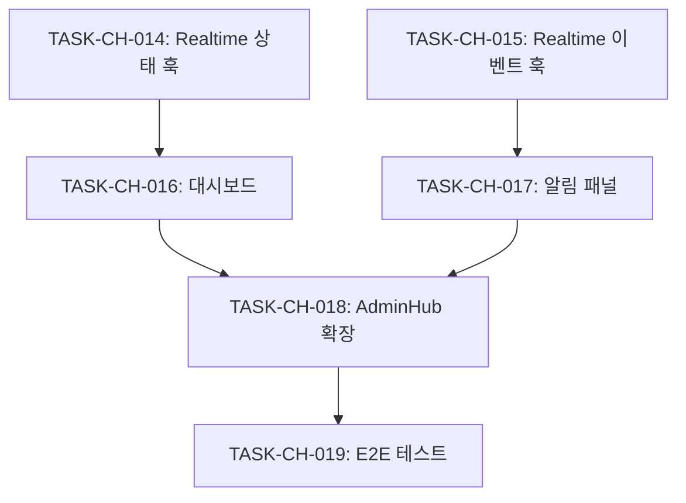

# Central Hub Sprint 3: 실시간 상태 동기화 + 관리자 대시보드

> 서비스 상태 실시간 모니터링 및 관리자 알림 시스템

**시작일**: 2025-11-24
**예상 소요**: 6시간 (병렬 2개 에이전트)
**관련 명세**: [spec/central-hub/requirements.md](../../spec/central-hub/requirements.md)
**관련 설계**: [plan/central-hub/architecture.md](../../plan/central-hub/architecture.md)
**이전 Sprint**: [sprint-2.md](sprint-2.md) ✅ 완료

---

## 목표

1. Supabase Realtime 채널을 활용한 서비스 상태 실시간 동기화
2. 관리자용 서비스 상태 대시보드 확장
3. 중요 이벤트/이슈 발생 시 알림 시스템

---

## 작업 목록

### TASK-CH-014: Realtime 서비스 상태 훅 생성
**예상 시간**: 2시간
**담당**: Agent 1
**상태**: ⏳ 대기

**구현 파일**:
- `src/hooks/useRealtimeServiceStatus.ts`

**주요 기능**:
```typescript
interface UseRealtimeServiceStatusResult {
  services: ServiceHealthStatus[];
  connectionStatus: 'connecting' | 'connected' | 'disconnected' | 'error';
  lastUpdate: Date | null;
  reconnect: () => void;
}

export function useRealtimeServiceStatus(): UseRealtimeServiceStatusResult;
```

**완료 조건**:
- [ ] Supabase Realtime 채널 구독 구현
- [ ] service_health 테이블 변경 감지
- [ ] 연결 상태 관리 (재연결 로직 포함)
- [ ] 에러 핸들링 및 복구
- [ ] TypeScript 타입 정의

---

### TASK-CH-015: Realtime 이벤트/이슈 스트림 훅 생성
**예상 시간**: 1.5시간
**담당**: Agent 1
**상태**: ⏳ 대기

**구현 파일**:
- `src/hooks/useRealtimeEventStream.ts`

**주요 기능**:
```typescript
interface UseRealtimeEventStreamResult {
  events: ServiceEvent[];
  issues: ServiceIssue[];
  newEventCount: number;
  newIssueCount: number;
  markAsRead: (type: 'event' | 'issue', ids: string[]) => void;
  clearUnread: () => void;
}

interface RealtimeEventStreamOptions {
  serviceFilter?: string[];
  severityFilter?: ('critical' | 'high' | 'medium' | 'low')[];
  maxEvents?: number;
}

export function useRealtimeEventStream(options?: RealtimeEventStreamOptions): UseRealtimeEventStreamResult;
```

**완료 조건**:
- [ ] service_events 테이블 Realtime 구독
- [ ] service_issues 테이블 Realtime 구독
- [ ] 필터링 옵션 지원
- [ ] 읽지 않은 항목 카운트
- [ ] 메모리 제한 (최대 100개 유지)

---

### TASK-CH-016: ServiceStatusDashboard 컴포넌트 생성
**예상 시간**: 2시간
**담당**: Agent 2
**상태**: ⏳ 대기

**구현 파일**:
- `src/components/admin/ServiceStatusDashboard.tsx`

**주요 기능**:
```typescript
interface ServiceStatusDashboardProps {
  className?: string;
}

export function ServiceStatusDashboard({ className }: ServiceStatusDashboardProps) {
  // 4개 Minu 서비스 상태 카드
  // 연결 상태 인디케이터
  // 마지막 업데이트 시간
  // 주요 메트릭 (요청 수, 에러율)
}
```

**UI 구성**:
- 4개 서비스 상태 카드 (Minu Find/Frame/Build/Keep)
- 상태별 색상 코드 (healthy: green, warning: yellow, critical: red, unknown: gray)
- 실시간 연결 상태 표시
- 마지막 통신 시간 (relative time)
- 24시간 가동률 표시

**완료 조건**:
- [ ] ServiceHealthCard 컴포넌트 생성
- [ ] 그리드 레이아웃 (2x2)
- [ ] 반응형 디자인 (모바일: 1열)
- [ ] 상태 변경 애니메이션
- [ ] 접근성 (ARIA labels)

---

### TASK-CH-017: RealtimeAlertPanel 컴포넌트 생성
**예상 시간**: 1.5시간
**담당**: Agent 2
**상태**: ⏳ 대기

**구현 파일**:
- `src/components/admin/RealtimeAlertPanel.tsx`

**주요 기능**:
```typescript
interface RealtimeAlertPanelProps {
  maxItems?: number;
  onAlertClick?: (alert: ServiceEvent | ServiceIssue) => void;
  className?: string;
}

export function RealtimeAlertPanel({ maxItems = 10, onAlertClick, className }: RealtimeAlertPanelProps);
```

**UI 구성**:
- 최근 알림 목록 (시간순 정렬)
- 심각도별 아이콘/색상
- 새 알림 하이라이트
- 알림 클릭 시 상세 보기
- "모두 읽음" 버튼

**완료 조건**:
- [ ] 알림 목록 UI
- [ ] 심각도별 스타일링
- [ ] 새 알림 표시 (pulse 애니메이션)
- [ ] 빈 상태 UI
- [ ] 스크롤 영역 (최대 높이 제한)

---

### TASK-CH-018: AdminHub 페이지 확장
**예상 시간**: 1시간
**담당**: Agent 2
**상태**: ⏳ 대기

**수정 파일**:
- `src/pages/admin/CentralHubDashboard.tsx` (기존 확장)

**추가 내용**:
- ServiceStatusDashboard 통합
- RealtimeAlertPanel 통합
- 레이아웃 재구성 (2열 그리드)
- 연결 상태 헤더 표시

**완료 조건**:
- [ ] 기존 대시보드에 실시간 컴포넌트 추가
- [ ] 레이아웃 최적화
- [ ] 로딩 상태 처리
- [ ] 에러 바운더리 추가

---

### TASK-CH-019: E2E 테스트 작성
**예상 시간**: 1시간
**담당**: Agent 1 + Agent 2 (공동)
**상태**: ⏳ 대기

**구현 파일**:
- `tests/e2e/admin/central-hub-realtime.spec.ts`

**테스트 범위** (10개 예상):
1. 서비스 상태 대시보드 렌더링
2. 4개 서비스 카드 표시
3. 연결 상태 인디케이터
4. 알림 패널 렌더링
5. 새 알림 카운트 표시
6. 알림 클릭 동작
7. "모두 읽음" 기능
8. 반응형 레이아웃 (모바일)
9. 에러 상태 표시
10. 로딩 상태 표시

**완료 조건**:
- [ ] 10개 E2E 테스트 작성
- [ ] 모든 테스트 통과
- [ ] 접근성 테스트 포함

---

## 의존성



---

## 검증 계획

### 기능 테스트
- [ ] Realtime 연결 성공
- [ ] 서비스 상태 변경 실시간 반영
- [ ] 이벤트/이슈 실시간 수신
- [ ] 알림 카운트 정확성

### 성능 테스트
- [ ] Realtime 지연 시간 < 500ms
- [ ] 100개 이상 이벤트 시 메모리 안정성
- [ ] 재연결 시간 < 3초

### 보안 테스트
- [ ] 인증된 사용자만 구독 가능
- [ ] 관리자 권한 확인

---

## 완료 조건

- [ ] Realtime 서비스 상태 훅 구현
- [ ] Realtime 이벤트 스트림 훅 구현
- [ ] ServiceStatusDashboard 컴포넌트 완성
- [ ] RealtimeAlertPanel 컴포넌트 완성
- [ ] AdminHub 페이지 확장
- [ ] E2E 테스트 10개 작성
- [ ] 빌드 성공
- [ ] 문서 업데이트 (CLAUDE.md, project-todo.md)

---

## 예상 결과물

```
src/hooks/
├── useRealtimeServiceStatus.ts    # 서비스 상태 Realtime 훅
└── useRealtimeEventStream.ts      # 이벤트/이슈 스트림 훅

src/components/admin/
├── ServiceStatusDashboard.tsx     # 서비스 상태 대시보드
├── ServiceHealthCard.tsx          # 개별 서비스 카드
└── RealtimeAlertPanel.tsx         # 실시간 알림 패널

tests/e2e/admin/
└── central-hub-realtime.spec.ts   # E2E 테스트 (10개)
```

---

## 다음 단계

Sprint 3 완료 후:
- Central Hub 기능 완성
- 프로덕션 배포 준비
- 모니터링 대시보드 고도화 (선택)
