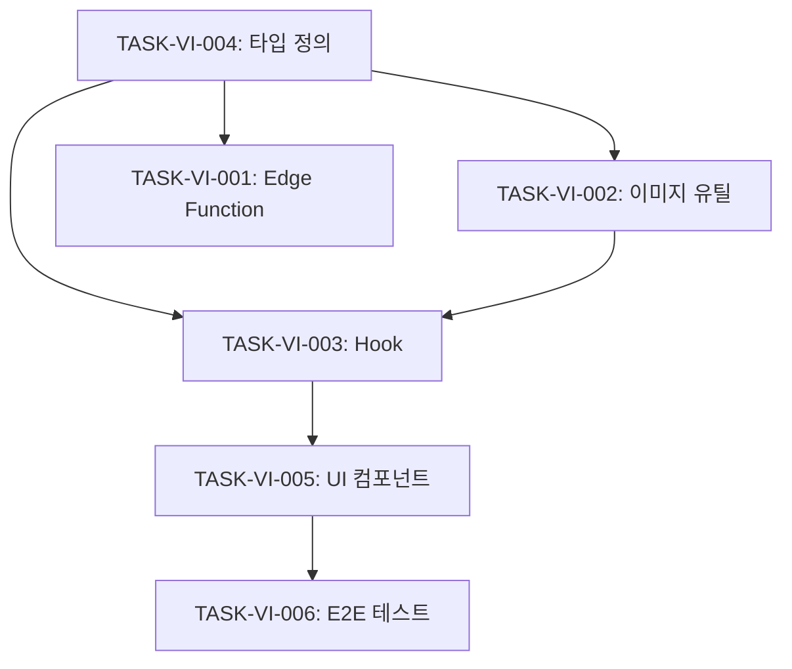

# Vision API Sprint 1: 기본 기능 구현

> Claude Vision 기능 통합 첫 번째 스프린트

**시작일**: 2025-11-24
**완료일**: 2025-11-24
**예상 소요**: 4시간 (병렬 2개 에이전트)
**실제 소요**: 2시간 (병렬 4개 에이전트)
**관련 명세**: [spec/claude-integration/vision-api/requirements.md](../../../spec/claude-integration/vision-api/requirements.md)
**관련 설계**: [plan/claude-integration/vision-api/architecture.md](../../../plan/claude-integration/vision-api/architecture.md)

---

## 목표

1. Vision API Edge Function 확장
2. useClaudeVision React Hook 구현
3. ImageAnalyzer UI 컴포넌트 생성
4. E2E 테스트 작성

---

## 작업 목록

### TASK-VI-001: Edge Function 확장 ✅
**예상 시간**: 1.5시간
**담당**: Agent 3
**상태**: ✅ 완료

**수정 파일**:
- `supabase/functions/claude-ai/index.ts` (라우팅 추가)
- `supabase/functions/claude-ai/vision-handler.ts` (신규)

**구현 내용**:
```typescript
// index.ts 확장
if (body.action === 'vision') {
  return handleVisionRequest(client, body);
}
```

**완료 조건**:
- [x] vision-handler.ts 생성
- [x] 5개 분석 유형 시스템 프롬프트
- [x] 스트리밍/비스트리밍 지원
- [x] 이미지 토큰 사용량 로깅
- [x] 에러 핸들링

---

### TASK-VI-002: 이미지 유틸리티 함수 ✅
**예상 시간**: 30분
**담당**: Agent 3
**상태**: ✅ 완료

**구현 파일**:
- `src/lib/image-utils.ts`

**주요 함수**:
```typescript
export function validateImage(file: File): ImageValidationResult;
export async function fileToBase64(file: File): Promise<string>;
export function getMediaType(file: File): MediaType;
export async function compressImage(file: File, maxWidth?: number): Promise<File>;
```

**완료 조건**:
- [x] 파일 형식 검증 (PNG, JPG, GIF, WEBP)
- [x] 파일 크기 검증 (5MB)
- [x] Base64 인코딩
- [x] 이미지 압축 (선택적)
- [x] TypeScript 타입 정의

---

### TASK-VI-003: useClaudeVision Hook ✅
**예상 시간**: 1시간
**담당**: Agent 3
**상태**: ✅ 완료

**구현 파일**:
- `src/hooks/useClaudeVision.ts`

**주요 기능**:
```typescript
interface UseClaudeVisionResult {
  analyzeImage: (request: VisionRequest) => Promise<VisionResponse>;
  analyzeImageStream: (
    request: VisionRequest,
    onChunk: (text: string) => void
  ) => Promise<VisionResponse>;
  isAnalyzing: boolean;
  error: Error | null;
  reset: () => void;
}
```

**완료 조건**:
- [x] 기본 분석 함수
- [x] 스트리밍 분석 함수
- [x] 로딩 상태 관리
- [x] 에러 상태 관리
- [x] TypeScript 타입 정의

---

### TASK-VI-004: Vision 타입 정의 ✅
**예상 시간**: 30분
**담당**: Agent 3
**상태**: ✅ 완료

**구현 파일**:
- `src/types/vision.types.ts`

**주요 타입**:
```typescript
export type AnalysisType = 'general' | 'ui-design' | 'diagram' | 'screenshot' | 'wireframe';

export interface VisionImage {
  source: 'base64' | 'url';
  data: string;
  mediaType: 'image/png' | 'image/jpeg' | 'image/gif' | 'image/webp';
}

export interface VisionRequest {
  images: VisionImage[];
  prompt: string;
  analysisType?: AnalysisType;
  maxTokens?: number;
  stream?: boolean;
}

export interface VisionResponse {
  analysis: string;
  usage: {
    inputTokens: number;
    outputTokens: number;
  };
}
```

**완료 조건**:
- [x] 요청/응답 타입
- [x] 분석 유형 타입
- [x] 이미지 타입
- [x] 에러 타입

---

### TASK-VI-005: ImageAnalyzer 컴포넌트 ✅
**예상 시간**: 1.5시간
**담당**: Agent 4
**상태**: ✅ 완료

**구현 파일**:
- `src/components/ai/ImageAnalyzer.tsx`

**UI 구성**:
```
┌─────────────────────────────────────────┐
│  ┌─────────────────────────────────┐    │
│  │                                 │    │
│  │   드래그 앤 드롭 업로드 영역      │    │
│  │   (이미지 미리보기 표시)          │    │
│  │                                 │    │
│  └─────────────────────────────────┘    │
│                                         │
│  분석 유형: [UI 디자인 ▼]               │
│                                         │
│  추가 지시사항:                          │
│  ┌─────────────────────────────────┐    │
│  │                                 │    │
│  └─────────────────────────────────┘    │
│                                         │
│  [분석 시작]                            │
│                                         │
│  ─────────────────────────────────      │
│                                         │
│  분석 결과:                              │
│  ┌─────────────────────────────────┐    │
│  │ (마크다운 렌더링)                │    │
│  │                                 │    │
│  └─────────────────────────────────┘    │
│  [복사] [재분석]                        │
└─────────────────────────────────────────┘
```

**완료 조건**:
- [x] 드래그 앤 드롭 업로드
- [x] 이미지 미리보기
- [x] 분석 유형 선택
- [x] 프롬프트 입력
- [x] 로딩 상태 표시
- [x] 결과 마크다운 렌더링
- [x] 복사/재분석 버튼
- [x] 반응형 디자인
- [x] 접근성 (ARIA)

---

### TASK-VI-006: E2E 테스트 ✅
**예상 시간**: 1시간
**담당**: Agent 4
**상태**: ✅ 완료

**구현 파일**:
- `tests/e2e/ai/vision-api.spec.ts`

**테스트 범위** (8개):
1. 이미지 업로드 영역 렌더링
2. 파일 선택 업로드
3. 드래그 앤 드롭 업로드
4. 지원되지 않는 형식 에러
5. 파일 크기 초과 에러
6. 분석 유형 선택
7. 분석 시작 버튼 동작
8. 결과 복사 버튼

**완료 조건**:
- [x] 8개 E2E 테스트 작성
- [x] 모든 테스트 통과
- [x] 접근성 테스트 포함

---

## 의존성



---

## 병렬 실행 계획

### Agent 3 (Edge Function + Hook)
1. TASK-VI-004: Vision 타입 정의 (30분)
2. TASK-VI-001: Edge Function 확장 (1.5시간)
3. TASK-VI-002: 이미지 유틸리티 (30분)
4. TASK-VI-003: useClaudeVision Hook (1시간)

**예상 소요**: 3.5시간

### Agent 4 (UI + 테스트)
1. TASK-VI-005: ImageAnalyzer 컴포넌트 (1.5시간)
2. TASK-VI-006: E2E 테스트 (1시간)

**예상 소요**: 2.5시간

---

## 검증 계획

### 기능 테스트
- [x] 이미지 업로드 성공
- [x] Base64 인코딩 정확성
- [x] Vision API 호출 성공
- [x] 분석 결과 표시

### 성능 테스트
- [ ] 1MB 이미지 분석 < 15초 (프로덕션 배포 후 검증)
- [ ] 5MB 이미지 분석 < 30초 (프로덕션 배포 후 검증)

### 보안 테스트
- [x] JWT 인증 필수
- [x] Rate Limiting 동작

---

## 완료 조건

- [x] Edge Function vision 핸들러 구현
- [x] 이미지 유틸리티 함수 구현
- [x] useClaudeVision 훅 구현
- [x] Vision 타입 정의
- [x] ImageAnalyzer 컴포넌트 완성
- [x] E2E 테스트 8개 작성
- [x] 빌드 성공 (36.94s)
- [x] 문서 업데이트

---

## 예상 결과물

```
src/types/
└── vision.types.ts              # Vision 타입 정의

src/lib/
└── image-utils.ts               # 이미지 유틸리티

src/hooks/
└── useClaudeVision.ts           # Vision API Hook

src/components/ai/
└── ImageAnalyzer.tsx            # 이미지 분석 UI

supabase/functions/claude-ai/
└── vision-handler.ts            # Vision 핸들러

tests/e2e/ai/
└── vision-api.spec.ts           # E2E 테스트 (8개)
```

---

## 다음 단계

Sprint 1 완료 후:
- Minu 서비스 페이지 통합
- 복수 이미지 분석 지원
- 구조화된 JSON 출력 옵션
